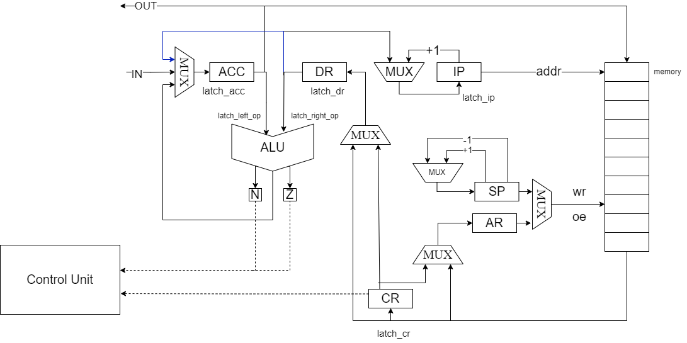
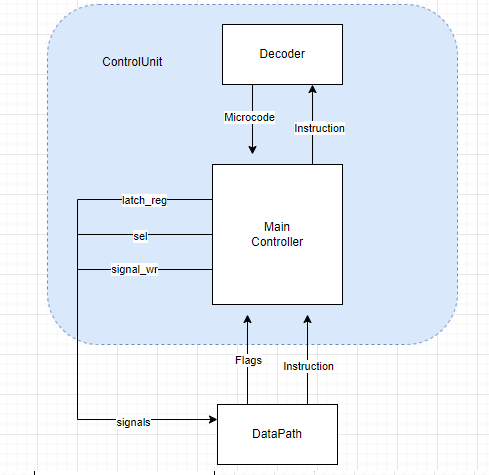

# Лабораторная работа №3.
___
- Бугаев Сергей Юрьевич
- `alg | acc | neum | mc | tick | struct | stream | port | cstr | prob1 | 8bit`
- Без усложнения

**Описание варианта**
- **alg** -- синтаксис языка должен напоминать java/javascript/lua. Должен поддерживать математические выражения.
- **acc** -- система команд должна быть выстроена вокруг аккумулятора.
  - Инструкции -- изменяют значение, хранимое в аккумуляторе.  
  - Ввод-вывод осуществляется через аккумулятор.
- **neum** -- фон Неймановская архитектура.
- **mc** -- microcoded.
- **tick** -- процессор необходимо моделировать с точностью до такта, процесс моделирования может быть приостановлен на любом такте
- **struct** -- машинный код в виде высокоуровневой структуры данных. Считается, что одна инструкция укладывается в одно машинное слово.
- **stream** -- Ввод-вывод осуществляется как поток токенов.
- **port** -- port-mapped (специальные инструкции для ввода-вывода)
- **cstr** -- Null-terminated (C string)
- **prob1** -- Multiples of 3 or 5
- **8bit** -- машинное слово -- 8 бит (как для памяти команд, так и для памяти данных, если они разделены). - **не реализовано**
___

## Язык программирования

- Описание синтаксиса:
```
<program> ::= <program_line> {<program>}

<program_line> ::= <variable declaration> | <conditional operator> | <loop> | <input> | <output>

<variable declaration> ::= [<type>] ["["<integer constant>"]"] <identifier> "=" <expression> ;

<type> :: = int | str

<id> ::= {<letter>}

<expression> ::= <arithmetic expression> | <id> | <literal>

<conditional operator> ::= if "(" <logical mapping> ")" "{"<telo_operator> "}"

<boolean expression> ::= (<identifier> (< | > | == ) < integer constant>) | (<identifier> % <integer constant> == <integer constant>)

<loop> ::= while ( <logical mapping> ) { <operator's phone number> }

<operator's phone number> ::= <program>

<arithmetic expression> ::= <term> { ( + | - | * | /) <arithmetic expression> }

<term> ::= <identifier> | <literal>

<literal> ::= <integer constant> | <string>

<integer constant> ::= <digit>+

<input> ::= read(<id>);

<output> ::= print(<id>|<string>);

<string> ::='{<any_ character>}'

<any_ character> ::= <letter> | <number> | ...

<letter> ::= a | ... | A ... | Z

<digit> ::= 0 | ... | 9
```
**Описание**
- Область видимости: Глобальная
- Статическая типизация.
- Типы данных включают в себя int, str.
- Виды литералов:
  - Целочисленные: 123
  - Строки: 'hello'
- Переменные хранятся на стеке

## Организация памяти

```
               Registers
+------------------------------------+
| ACC - аккумулятор                  |
+------------------------------------+
| CR - регистр инструкции            |
+------------------------------------+
| DR - регистр данных                |
+------------------------------------+
| IP - счётчик команд                |
+------------------------------------+
| SP - указатель стека               |
+------------------------------------+
| AR - адрес записи в память         |
+------------------------------------+

```
- Память данных и команд общая (фон Нейман)
- Виды адресации:
    - абсолютная
    - непосредственная адресация
    - косвенная
- Назначение регистров
    - ACC -- главный регистр (аккумуляторная архитектура), содержит результаты всех операций, ввод-вывод реализуется с него
    - CR -- содержит текущую выполняемую инструкцию
    - DR -- вспомомогательный регистр
    - IP -- содержит адрес следующей инструкции, которая должна быть выполнена
    - SP -- Указтаель на вершину стека
    - AR -- содержит адрес, по которому произойдет запись или чтение из памяти
- Циклы выполнения команды:
  - Цикл выборки инструкции: 1 такт
  - Цикл выборки операнда: 2-3 такта (Зависит от вида адресации)
  - Цикл выполнения команды: 1-3 такта
- Константы отсутствуют в языке
- В одном машинном слове хранится 1 символ строкового литерала
- Переменные помещаются на стек
### Работа со строковыми литералами:
- Строковые литералы хранятся в памяти последовательно
- Если встречается команда print('some'); -- символы внутри print после трансляции хранятся последовательно и представлены командой NOP
- Если встречается конструкция str some_str [number] = 'some' -- в памяти после всех инструкций или после последнего строкового литерала выделяется память длиной number
- Если встречается коснтрукция str some_str = 'some' --в памяти после всех инструкций или после последнего строкового литерала выделяется память длиной строки
- Конструкция str some_str [number] требуется для корректной работы со считыванием данных, так как шанс затирания последующих данных снижается

## Система команд

Особенности процессора:

- Доступ к вводу-выводу происходит через специальные команды READ  (1 - Порт для буффера, 2 - Порт для вывода), порты конфигурируются в [isa](machine/isa.py)

Цикл команды:

- Выборка инструкции -- mem[IP] -> CR, IP+1 -> IP
- Выборка операнда --
  - addr-> AR, mem[AR] -> DR (Абсолютная);
  - addr -> DR (Непосредственная);
  - addr -> AR, mem[AR] -> AR, mem[AR] -> DR (косвенная)
- Выполнение команды 


### Набор инструкций

| Инструкция         | Описание                                                                         |
|:-------------------|:---------------------------------------------------------------------------------|
| ST `<addr>`        | Сохранить в память значение из аккумулятора                                      |
| LD  `<addr>`       | Загрузить в аккумулятор значение из памяти                                       |
| ADD `<addr>`       | Сложить значение аккумулятора с значением из памяти, записать в аккумулятор      |
| SUB `<addr>`       | Вычесть из значения аккумулятора значение из памяти, записать в аккумулятор      |
| MUL `<addr>`       | Умножить значение аккумулятора на значение из памяти, записать в аккумулятор     |
| DIV `<addr>`       | Поделить значение аккумулятора на значение из памяти, записать в аккумулятор     |
| JUMP `<addr>`      | перейти по адресу                                                                |
| PUSH               | Сохранить в стек значение аккумулятора                                           |
| NOP                | отсутствие операции                                                              |
| POP                | Загрузить в аккумулятор значение со стека                                        | 
| CMP `<addr>`       | Выставить значения флагов при сравнении аккумулятора и значения из памяти        | 
| JE `<addr>`        | перейти по адресу, если флаг Z == 1                                              |
| JNE `<addr>`       | перейти по адресу, если флаг Z == 0                                              |              
| JA `<addr>`        | перейти по адресу, если флаг N == 0                                              |
| JB `<addr>`        | перейти по адресу, если флаг N == 1                                              |
| HALT               | Остановка симуляции                                                              |
| INC                | Прибавить к аккумулятору 1                                                       |

- `<addr>` -- абсолютная/косвенная/непосредственная адресация

### Кодирование инструкций

- Машинный код сереализуется в список JSON
- Один элемент списка -- одна инструкция

Пример:

```json
[
    {
        "index": 0,
        "opcode": "Opcode.JUMP",
        "arg1": "#",
        "arg2": 14
    }
]
```

где:

- `index` -- адрес в памяти
- `opcode` -- код операции
- `arg1` -- вид адресации
- `arg2` -- аргумент

Типы данных в модуле [isa](machine/isa.py), где:

- `Opcode` -- перечисление кодов операций
- 'TypesOfAddressing' -- доступные виды адресации 
## Транслятор

Интерфейс командной строки: `translator.py <input_file> <target_file>`

Реализовано в модуле: [translator](translator/translate.py)

Этапы трансляции:
Трансляция происходит в 3 шага:
1. [Lexer](translator/lexer.py) - разбивает код из <input_file> на токены
2. [AST](translator/ast.py) - используя токены, строит AST
3. [translator](translator/translate.py) - используя AST, создаётся машинный код, записывает в виде json в <target_file>

## Модель процессора

Интерфейс командной строки: `machine.py <machine_code_file> <input_file>`

Реализовано в модуле: [machine](machine/processor.py).

**Datapath**



Реализован в [machine](machine/data_path.py).

Регистры (соответствуют регистрам на схеме):

- `ACC`
- `DR`
- `CR`
- `AR`
- `SP`
- `IP`


Сигналы:
- `latch_ar` -- защелкнуть адресный регистр (addr->AR | mem[AR] -> AR)
- `latch_acc` -- защелкнуть аккумулятор (DR -> ACC | ALU_result -> ACC | mem[sp] -> ACC)
- `latch_ip` -- защелкнуть счетчик команд ( IP+1 -> IP | DR->IP)
- `latch_sp` -- защелкнуть регистр стека (SP+1-> SP | SP-1 -> SP)
- `latch_dr` -- защелкнуть регистр данных
- `latch_cr` -- защелкнуть регистр команд mem[IP] -> CR
- `latch_left_op` -- ACC -> left_operand
- `latch_right_op` -- ACC -> right_operand
- `signal_wr` -- запись в память ACC
- `calculate` -- выполнить операцию на АЛУ
- `get_flags` -- Получить флаги с АЛУ

Селекторы для мультиплексоров реализованы с помощью Enum в [machine](machine/data_path.py) классом Selector

Флаги:
- `N` (negative) -- результат в алу содержит отрицательное число
- `Z` (zero) -- результат в алу содержит ноль

**ControlUnit**



Реализован в [machine](machine/control_unit.py).
- Получает из DataPath команду, декодирует её
- Выполняет микрокод:
  - Включает в себя сигналы и мультиплексоры для DataPath
  - Хранится в отдельной памяти в Control Unit
  - Названия каждого бита:
    - **latch_cr** -- защелкнуть адресный регистр
    - **sel_ip** -- Мультиплексор для ip
    - **latch_ip** -- защелкнуть счетчик команд
    - **sel_ar**  -- Мультиплексор для ar
    - **latch_ar** -- защелкнуть адресный регистр
    - **sel_oe** -- Мультиплексор для oe
    - **signal_oe** -- сигнал для чтения
    - **sel_dr** -- Мультиплексор для dr
    - **latch_dr** -- защелкнуть регистр данных
    - **latch_left_op** -- -- ACC -> left_operand
    - **latch_right_op** -- ACC -> right_operand
    - **signal_calculate** -- выполнить операцию на АЛУ
    - **check_flags** -- проверка флагов
    - **sel_acc** -- Мультиплексор для acc
    - **latch_acc** -- защелкнуть аккумулятор
    - **sel_wr** -- Мультиплексор для wr
    - **signal_wr**  -- сигнал на запись в память
    - **sel_sp** -- Мультиплексор для sp
    - **latch_sp** - защелкнуть SP
    - **latch_out** -- Запись в порт для выхода
    - **mux_port** -- Выбор порта 
    - **latch_in** -- Запись в порт для входа
    - **mux_mPC** -- 4 возможных значения
      - +1 -- переход к следующей микрокоманде
      - 0 -- переход к 0 микрокоманде
      - DECODE_OP_FETCH -- декодировать цикл выборки операнда
      - DECODE_COMMAND -- декодировать исполнение команды
    - **latch_mPC** -- защёлкнуть счётчик микрокоманд
- Класс MicrocodeMemory в [Control unit](machine/control_unit.py) представляет собой память микроинструкций, на каждом такте происходит считывание очередной микроинструкции и отправки нужных сигналов в DataPath
  - 0 ячейка - Instruction Fetch
  - 1-7 ячейка - Operand Fetch
  - 8-20 ячейки - Выполнение команды
- Метод `process_tick` моделирует выполнение следующего такта
- Для журнала состояний процессора используется стандартный модуль `logging`
- Каждая запись в журнале соответсвует состоянию процессора **после** выполнения инструкции
- Количество инструкций для моделирования лимитировано
- Остановка моделирования осуществляется при:
    - превышении лимита количества тактов
    - исключении `HaltError` (команда `halt`)
    - Попытке получить данные из пустого буфера

## Тестирование

Реализованные программы:

1. [hello_world](./examples/hello_world.lab3) -- печатаем 'Hello, World!'
1. [cat](./examples/cat.lab3) --  программа cat, повторяем ввод на выводе
1. [hello_usr](./examples/hello_user.lab3) -- запросить у пользователя его имя, считать его, вывести на экран приветствие
1. [prob1](./examples/prob1.lab3) --  сумма всех чисел, кратных 3 или 5, меньше 1000.

Интеграционные тесты реализованы в [integration_test](./integration_test.py):

- Стратегия: golden tests, конфигурация в папке [golden/](./golden/)

CI при помощи Github Action:

```yaml
defaults:
  run:
    working-directory: ./

jobs:
  test:
    runs-on: ubuntu-latest

    steps:
      - name: Checkout code
        uses: actions/checkout@v4

      - name: Set up Python
        uses: actions/setup-python@v4
        with:
          python-version: 3.11

      - name: Install dependencies
        run: |
          python -m pip install --upgrade pip
          pip install poetry
          poetry install

      - name: Run tests and collect coverage
        run: |
          poetry run coverage run -m pytest .
          poetry run coverage report -m
        env:
          CI: true

  lint:
    runs-on: ubuntu-latest

    steps:
      - name: Checkout code
        uses: actions/checkout@v4

      - name: Set up Python
        uses: actions/setup-python@v4
        with:
          python-version: 3.11

      - name: Install dependencies
        run: |
          python -m pip install --upgrade pip
          pip install poetry
          poetry install

      - name: Check code formatting with Ruff
        run: poetry run ruff format --check .

      - name: Run Ruff linters
        run: poetry run ruff check .
```

Пример использования и журнал работы процессора на примере cat
```
- Код:
  int n = 0;
  str a [20] = '';
  read(n);
  while (n>0) {
      a = a + n;
      read(n);
  }
  print(a);
```
- Машинный код:
```
[{"index": 0, "opcode": "Opcode.LD", "arg1": "#", "arg2": 0},
{"index": 1, "opcode": "Opcode.PUSH", "arg1": null, "arg2": null},
{"index": 2, "opcode": "Opcode.LD", "arg1": "#", "arg2": 4097},
{"index": 3, "opcode": "Opcode.PUSH", "arg1": null, "arg2": null},
{"index": 4, "opcode": "Opcode.LD", "arg1": "#", "arg2": 0},
{"index": 5, "opcode": "Opcode.ST", "arg1": "=", "arg2": 4097},
{"index": 6, "opcode": "Opcode.READ", "arg1": null, "arg2": 1},
{"index": 7, "opcode": "Opcode.ST", "arg1": "=", "arg2": 8095},
{"index": 8, "opcode": "Opcode.LD", "arg1": "=", "arg2": 8095},
{"index": 9, "opcode": "Opcode.CMP", "arg1": "#", "arg2": 0},
{"index": 10, "opcode": "Opcode.JB", "arg1": "#", "arg2": 26},
{"index": 11, "opcode": "Opcode.LD", "arg1": "#", "arg2": 4097},
{"index": 12, "opcode": "Opcode.PUSH", "arg1": null, "arg2": null},
{"index": 13, "opcode": "Opcode.LD", "arg1": "~", "arg2": 8093},
{"index": 14, "opcode": "Opcode.CMP", "arg1": "#", "arg2": 0},
{"index": 15, "opcode": "Opcode.JE", "arg1": "#", "arg2": 20},
{"index": 16, "opcode": "Opcode.POP", "arg1": null, "arg2": null},
{"index": 17, "opcode": "Opcode.INC", "arg1": null, "arg2": null},
{"index": 18, "opcode": "Opcode.PUSH", "arg1": null, "arg2": null},
{"index": 19, "opcode": "Opcode.JUMP", "arg1": "#", "arg2": 13},
{"index": 20, "opcode": "Opcode.LD", "arg1": "=", "arg2": 8095},
{"index": 21, "opcode": "Opcode.ST", "arg1": "~", "arg2": 8093},
{"index": 22, "opcode": "Opcode.POP", "arg1": null, "arg2": null},
{"index": 23, "opcode": "Opcode.READ", "arg1": null, "arg2": 1},
{"index": 24, "opcode": "Opcode.ST", "arg1": "=", "arg2": 8095},
{"index": 25, "opcode": "Opcode.JUMP", "arg1": "#", "arg2": 8},
{"index": 26, "opcode": "Opcode.LD", "arg1": "#", "arg2": 4097},
{"index": 27, "opcode": "Opcode.PUSH", "arg1": null, "arg2": null},
{"index": 28, "opcode": "Opcode.LD", "arg1": "~", "arg2": 8093},
{"index": 29, "opcode": "Opcode.PRINT", "arg1": null, "arg2": 2},
{"index": 30, "opcode": "Opcode.CMP", "arg1": "#", "arg2": 0},
{"index": 31, "opcode": "Opcode.JE", "arg1": "#", "arg2": 36},
{"index": 32, "opcode": "Opcode.POP", "arg1": null, "arg2": null},
{"index": 33, "opcode": "Opcode.INC", "arg1": null, "arg2": null},
{"index": 34, "opcode": "Opcode.PUSH", "arg1": null, "arg2": null},
{"index": 35, "opcode": "Opcode.JUMP", "arg1": "#", "arg2": 28},
{"index": 36, "opcode": "Opcode.POP", "arg1": null, "arg2": null},
{"index": 37, "opcode": "Opcode.HALT", "arg1": null, "arg2": null}]
```

- Вывод программы:
Dmitry

- Журнал работы:
```
INFO    processor:simulation    Simulation start
  INFO    controlunit:microcode_handler execute_command       Opcode.LD | tick:          3 | ip:          1 | dr          0 |ar:          0 | acc:          0 | sp:       8095
  INFO    controlunit:microcode_handler execute_command     Opcode.PUSH | tick:          6 | ip:          2 | dr          0 |ar:          0 | acc:          0 | sp:       8094
  INFO    controlunit:microcode_handler execute_command       Opcode.LD | tick:          9 | ip:          3 | dr       4097 |ar:          0 | acc:       4097 | sp:       8094
  INFO    controlunit:microcode_handler execute_command     Opcode.PUSH | tick:         12 | ip:          4 | dr       4097 |ar:          0 | acc:       4097 | sp:       8093
  INFO    controlunit:microcode_handler execute_command       Opcode.LD | tick:         15 | ip:          5 | dr          0 |ar:          0 | acc:          0 | sp:       8093
  INFO    controlunit:microcode_handler execute_command       Opcode.ST | tick:         19 | ip:          6 | dr          0 |ar:       4097 | acc:          0 | sp:       8093
  DEBUG   datapath:get_char_from_device INPUT-> D
  INFO    controlunit:microcode_handler execute_command     Opcode.READ | tick:         23 | ip:          7 | dr          0 |ar:       4097 | acc:         68 | sp:       8093
  INFO    controlunit:microcode_handler execute_command       Opcode.ST | tick:         27 | ip:          8 | dr          0 |ar:       8095 | acc:         68 | sp:       8093
  INFO    controlunit:microcode_handler execute_command       Opcode.LD | tick:         31 | ip:          9 | dr         68 |ar:       8095 | acc:         68 | sp:       8093
  INFO    controlunit:microcode_handler execute_command      Opcode.CMP | tick:         34 | ip:         10 | dr          0 |ar:       8095 | acc:         68 | sp:       8093
  INFO    controlunit:microcode_handler execute_command       Opcode.JB | tick:         37 | ip:         11 | dr         26 |ar:       8095 | acc:         68 | sp:       8093
  INFO    controlunit:microcode_handler execute_command       Opcode.LD | tick:         40 | ip:         12 | dr       4097 |ar:       8095 | acc:       4097 | sp:       8093
  INFO    controlunit:microcode_handler execute_command     Opcode.PUSH | tick:         43 | ip:         13 | dr       4097 |ar:       8095 | acc:       4097 | sp:       8092
  INFO    controlunit:microcode_handler execute_command       Opcode.LD | tick:         48 | ip:         14 | dr          0 |ar:       4097 | acc:          0 | sp:       8092
  INFO    controlunit:microcode_handler execute_command      Opcode.CMP | tick:         51 | ip:         15 | dr          0 |ar:       4097 | acc:          0 | sp:       8092
  INFO    controlunit:microcode_handler execute_command       Opcode.JE | tick:         55 | ip:         20 | dr         20 |ar:       4097 | acc:          0 | sp:       8092
  INFO    controlunit:microcode_handler execute_command       Opcode.LD | tick:         59 | ip:         21 | dr         68 |ar:       8095 | acc:         68 | sp:       8092
  INFO    controlunit:microcode_handler execute_command       Opcode.ST | tick:         64 | ip:         22 | dr          0 |ar:       4097 | acc:         68 | sp:       8092
  INFO    controlunit:microcode_handler execute_command      Opcode.POP | tick:         69 | ip:         23 | dr       4097 |ar:       4097 | acc:       4097 | sp:       8093
  DEBUG   datapath:get_char_from_device INPUT-> m
  INFO    controlunit:microcode_handler execute_command     Opcode.READ | tick:         73 | ip:         24 | dr       4097 |ar:       4097 | acc:        109 | sp:       8093
  INFO    controlunit:microcode_handler execute_command       Opcode.ST | tick:         77 | ip:         25 | dr         68 |ar:       8095 | acc:        109 | sp:       8093
  INFO    controlunit:microcode_handler execute_command     Opcode.JUMP | tick:         80 | ip:          8 | dr          8 |ar:       8095 | acc:        109 | sp:       8093
  INFO    controlunit:microcode_handler execute_command       Opcode.LD | tick:         84 | ip:          9 | dr        109 |ar:       8095 | acc:        109 | sp:       8093
  INFO    controlunit:microcode_handler execute_command      Opcode.CMP | tick:         87 | ip:         10 | dr          0 |ar:       8095 | acc:        109 | sp:       8093
  INFO    controlunit:microcode_handler execute_command       Opcode.JB | tick:         90 | ip:         11 | dr         26 |ar:       8095 | acc:        109 | sp:       8093
  INFO    controlunit:microcode_handler execute_command       Opcode.LD | tick:         93 | ip:         12 | dr       4097 |ar:       8095 | acc:       4097 | sp:       8093
  INFO    controlunit:microcode_handler execute_command     Opcode.PUSH | tick:         96 | ip:         13 | dr       4097 |ar:       8095 | acc:       4097 | sp:       8092
  INFO    controlunit:microcode_handler execute_command       Opcode.LD | tick:        101 | ip:         14 | dr         68 |ar:       4097 | acc:         68 | sp:       8092
  INFO    controlunit:microcode_handler execute_command      Opcode.CMP | tick:        104 | ip:         15 | dr          0 |ar:       4097 | acc:         68 | sp:       8092
  INFO    controlunit:microcode_handler execute_command       Opcode.JE | tick:        107 | ip:         16 | dr         20 |ar:       4097 | acc:         68 | sp:       8092
  INFO    controlunit:microcode_handler execute_command      Opcode.POP | tick:        112 | ip:         17 | dr       4097 |ar:       4097 | acc:       4097 | sp:       8093
  INFO    controlunit:microcode_handler execute_command      Opcode.INC | tick:        115 | ip:         18 | dr       4097 |ar:       4097 | acc:       4098 | sp:       8093
  INFO    controlunit:microcode_handler execute_command     Opcode.PUSH | tick:        118 | ip:         19 | dr       4097 |ar:       4097 | acc:       4098 | sp:       8092
  INFO    controlunit:microcode_handler execute_command     Opcode.JUMP | tick:        121 | ip:         13 | dr         13 |ar:       4097 | acc:       4098 | sp:       8092
  INFO    controlunit:microcode_handler execute_command       Opcode.LD | tick:        126 | ip:         14 | dr          0 |ar:       4098 | acc:          0 | sp:       8092
  INFO    controlunit:microcode_handler execute_command      Opcode.CMP | tick:        129 | ip:         15 | dr          0 |ar:       4098 | acc:          0 | sp:       8092
  INFO    controlunit:microcode_handler execute_command       Opcode.JE | tick:        133 | ip:         20 | dr         20 |ar:       4098 | acc:          0 | sp:       8092
  INFO    controlunit:microcode_handler execute_command       Opcode.LD | tick:        137 | ip:         21 | dr        109 |ar:       8095 | acc:        109 | sp:       8092
  INFO    controlunit:microcode_handler execute_command       Opcode.ST | tick:        142 | ip:         22 | dr          0 |ar:       4098 | acc:        109 | sp:       8092
  INFO    controlunit:microcode_handler execute_command      Opcode.POP | tick:        147 | ip:         23 | dr       4098 |ar:       4098 | acc:       4098 | sp:       8093
  DEBUG   datapath:get_char_from_device INPUT-> i
  INFO    controlunit:microcode_handler execute_command     Opcode.READ | tick:        151 | ip:         24 | dr       4098 |ar:       4098 | acc:        105 | sp:       8093
  INFO    controlunit:microcode_handler execute_command       Opcode.ST | tick:        155 | ip:         25 | dr        109 |ar:       8095 | acc:        105 | sp:       8093
  INFO    controlunit:microcode_handler execute_command     Opcode.JUMP | tick:        158 | ip:          8 | dr          8 |ar:       8095 | acc:        105 | sp:       8093
  INFO    controlunit:microcode_handler execute_command       Opcode.LD | tick:        162 | ip:          9 | dr        105 |ar:       8095 | acc:        105 | sp:       8093
  INFO    controlunit:microcode_handler execute_command      Opcode.CMP | tick:        165 | ip:         10 | dr          0 |ar:       8095 | acc:        105 | sp:       8093
  INFO    controlunit:microcode_handler execute_command       Opcode.JB | tick:        168 | ip:         11 | dr         26 |ar:       8095 | acc:        105 | sp:       8093
  INFO    controlunit:microcode_handler execute_command       Opcode.LD | tick:        171 | ip:         12 | dr       4097 |ar:       8095 | acc:       4097 | sp:       8093
  INFO    controlunit:microcode_handler execute_command     Opcode.PUSH | tick:        174 | ip:         13 | dr       4097 |ar:       8095 | acc:       4097 | sp:       8092
  INFO    controlunit:microcode_handler execute_command       Opcode.LD | tick:        179 | ip:         14 | dr         68 |ar:       4097 | acc:         68 | sp:       8092
  INFO    controlunit:microcode_handler execute_command      Opcode.CMP | tick:        182 | ip:         15 | dr          0 |ar:       4097 | acc:         68 | sp:       8092
  INFO    controlunit:microcode_handler execute_command       Opcode.JE | tick:        185 | ip:         16 | dr         20 |ar:       4097 | acc:         68 | sp:       8092
  INFO    controlunit:microcode_handler execute_command      Opcode.POP | tick:        190 | ip:         17 | dr       4097 |ar:       4097 | acc:       4097 | sp:       8093
  INFO    controlunit:microcode_handler execute_command      Opcode.INC | tick:        193 | ip:         18 | dr       4097 |ar:       4097 | acc:       4098 | sp:       8093
  INFO    controlunit:microcode_handler execute_command     Opcode.PUSH | tick:        196 | ip:         19 | dr       4097 |ar:       4097 | acc:       4098 | sp:       8092
  INFO    controlunit:microcode_handler execute_command     Opcode.JUMP | tick:        199 | ip:         13 | dr         13 |ar:       4097 | acc:       4098 | sp:       8092
  INFO    controlunit:microcode_handler execute_command       Opcode.LD | tick:        204 | ip:         14 | dr        109 |ar:       4098 | acc:        109 | sp:       8092
  INFO    controlunit:microcode_handler execute_command      Opcode.CMP | tick:        207 | ip:         15 | dr          0 |ar:       4098 | acc:        109 | sp:       8092
  INFO    controlunit:microcode_handler execute_command       Opcode.JE | tick:        210 | ip:         16 | dr         20 |ar:       4098 | acc:        109 | sp:       8092
  INFO    controlunit:microcode_handler execute_command      Opcode.POP | tick:        215 | ip:         17 | dr       4098 |ar:       4098 | acc:       4098 | sp:       8093
  INFO    controlunit:microcode_handler execute_command      Opcode.INC | tick:        218 | ip:         18 | dr       4098 |ar:       4098 | acc:       4099 | sp:       8093
  INFO    controlunit:microcode_handler execute_command     Opcode.PUSH | tick:        221 | ip:         19 | dr       4098 |ar:       4098 | acc:       4099 | sp:       8092
  INFO    controlunit:microcode_handler execute_command     Opcode.JUMP | tick:        224 | ip:         13 | dr         13 |ar:       4098 | acc:       4099 | sp:       8092
  INFO    controlunit:microcode_handler execute_command       Opcode.LD | tick:        229 | ip:         14 | dr          0 |ar:       4099 | acc:          0 | sp:       8092
  INFO    controlunit:microcode_handler execute_command      Opcode.CMP | tick:        232 | ip:         15 | dr          0 |ar:       4099 | acc:          0 | sp:       8092
  INFO    controlunit:microcode_handler execute_command       Opcode.JE | tick:        236 | ip:         20 | dr         20 |ar:       4099 | acc:          0 | sp:       8092
  INFO    controlunit:microcode_handler execute_command       Opcode.LD | tick:        240 | ip:         21 | dr        105 |ar:       8095 | acc:        105 | sp:       8092
  INFO    controlunit:microcode_handler execute_command       Opcode.ST | tick:        245 | ip:         22 | dr          0 |ar:       4099 | acc:        105 | sp:       8092
  INFO    controlunit:microcode_handler execute_command      Opcode.POP | tick:        250 | ip:         23 | dr       4099 |ar:       4099 | acc:       4099 | sp:       8093
  DEBUG   datapath:get_char_from_device INPUT-> t
  INFO    controlunit:microcode_handler execute_command     Opcode.READ | tick:        254 | ip:         24 | dr       4099 |ar:       4099 | acc:        116 | sp:       8093
  INFO    controlunit:microcode_handler execute_command       Opcode.ST | tick:        258 | ip:         25 | dr        105 |ar:       8095 | acc:        116 | sp:       8093
  INFO    controlunit:microcode_handler execute_command     Opcode.JUMP | tick:        261 | ip:          8 | dr          8 |ar:       8095 | acc:        116 | sp:       8093
  INFO    controlunit:microcode_handler execute_command       Opcode.LD | tick:        265 | ip:          9 | dr        116 |ar:       8095 | acc:        116 | sp:       8093
  INFO    controlunit:microcode_handler execute_command      Opcode.CMP | tick:        268 | ip:         10 | dr          0 |ar:       8095 | acc:        116 | sp:       8093
  INFO    controlunit:microcode_handler execute_command       Opcode.JB | tick:        271 | ip:         11 | dr         26 |ar:       8095 | acc:        116 | sp:       8093
  INFO    controlunit:microcode_handler execute_command       Opcode.LD | tick:        274 | ip:         12 | dr       4097 |ar:       8095 | acc:       4097 | sp:       8093
  INFO    controlunit:microcode_handler execute_command     Opcode.PUSH | tick:        277 | ip:         13 | dr       4097 |ar:       8095 | acc:       4097 | sp:       8092
  INFO    controlunit:microcode_handler execute_command       Opcode.LD | tick:        282 | ip:         14 | dr         68 |ar:       4097 | acc:         68 | sp:       8092
  INFO    controlunit:microcode_handler execute_command      Opcode.CMP | tick:        285 | ip:         15 | dr          0 |ar:       4097 | acc:         68 | sp:       8092
  INFO    controlunit:microcode_handler execute_command       Opcode.JE | tick:        288 | ip:         16 | dr         20 |ar:       4097 | acc:         68 | sp:       8092
  INFO    controlunit:microcode_handler execute_command      Opcode.POP | tick:        293 | ip:         17 | dr       4097 |ar:       4097 | acc:       4097 | sp:       8093
  INFO    controlunit:microcode_handler execute_command      Opcode.INC | tick:        296 | ip:         18 | dr       4097 |ar:       4097 | acc:       4098 | sp:       8093
  INFO    controlunit:microcode_handler execute_command     Opcode.PUSH | tick:        299 | ip:         19 | dr       4097 |ar:       4097 | acc:       4098 | sp:       8092
  INFO    controlunit:microcode_handler execute_command     Opcode.JUMP | tick:        302 | ip:         13 | dr         13 |ar:       4097 | acc:       4098 | sp:       8092
  INFO    controlunit:microcode_handler execute_command       Opcode.LD | tick:        307 | ip:         14 | dr        109 |ar:       4098 | acc:        109 | sp:       8092
  INFO    controlunit:microcode_handler execute_command      Opcode.CMP | tick:        310 | ip:         15 | dr          0 |ar:       4098 | acc:        109 | sp:       8092
  INFO    controlunit:microcode_handler execute_command       Opcode.JE | tick:        313 | ip:         16 | dr         20 |ar:       4098 | acc:        109 | sp:       8092
  INFO    controlunit:microcode_handler execute_command      Opcode.POP | tick:        318 | ip:         17 | dr       4098 |ar:       4098 | acc:       4098 | sp:       8093
  INFO    controlunit:microcode_handler execute_command      Opcode.INC | tick:        321 | ip:         18 | dr       4098 |ar:       4098 | acc:       4099 | sp:       8093
  INFO    controlunit:microcode_handler execute_command     Opcode.PUSH | tick:        324 | ip:         19 | dr       4098 |ar:       4098 | acc:       4099 | sp:       8092
  INFO    controlunit:microcode_handler execute_command     Opcode.JUMP | tick:        327 | ip:         13 | dr         13 |ar:       4098 | acc:       4099 | sp:       8092
  INFO    controlunit:microcode_handler execute_command       Opcode.LD | tick:        332 | ip:         14 | dr        105 |ar:       4099 | acc:        105 | sp:       8092
  INFO    controlunit:microcode_handler execute_command      Opcode.CMP | tick:        335 | ip:         15 | dr          0 |ar:       4099 | acc:        105 | sp:       8092
  INFO    controlunit:microcode_handler execute_command       Opcode.JE | tick:        338 | ip:         16 | dr         20 |ar:       4099 | acc:        105 | sp:       8092
  INFO    controlunit:microcode_handler execute_command      Opcode.POP | tick:        343 | ip:         17 | dr       4099 |ar:       4099 | acc:       4099 | sp:       8093
  INFO    controlunit:microcode_handler execute_command      Opcode.INC | tick:        346 | ip:         18 | dr       4099 |ar:       4099 | acc:       4100 | sp:       8093
  INFO    controlunit:microcode_handler execute_command     Opcode.PUSH | tick:        349 | ip:         19 | dr       4099 |ar:       4099 | acc:       4100 | sp:       8092
  INFO    controlunit:microcode_handler execute_command     Opcode.JUMP | tick:        352 | ip:         13 | dr         13 |ar:       4099 | acc:       4100 | sp:       8092
  INFO    controlunit:microcode_handler execute_command       Opcode.LD | tick:        357 | ip:         14 | dr          0 |ar:       4100 | acc:          0 | sp:       8092
  INFO    controlunit:microcode_handler execute_command      Opcode.CMP | tick:        360 | ip:         15 | dr          0 |ar:       4100 | acc:          0 | sp:       8092
  INFO    controlunit:microcode_handler execute_command       Opcode.JE | tick:        364 | ip:         20 | dr         20 |ar:       4100 | acc:          0 | sp:       8092
  INFO    controlunit:microcode_handler execute_command       Opcode.LD | tick:        368 | ip:         21 | dr        116 |ar:       8095 | acc:        116 | sp:       8092
  INFO    controlunit:microcode_handler execute_command       Opcode.ST | tick:        373 | ip:         22 | dr          0 |ar:       4100 | acc:        116 | sp:       8092
  INFO    controlunit:microcode_handler execute_command      Opcode.POP | tick:        378 | ip:         23 | dr       4100 |ar:       4100 | acc:       4100 | sp:       8093
  DEBUG   datapath:get_char_from_device INPUT-> r
  INFO    controlunit:microcode_handler execute_command     Opcode.READ | tick:        382 | ip:         24 | dr       4100 |ar:       4100 | acc:        114 | sp:       8093
  INFO    controlunit:microcode_handler execute_command       Opcode.ST | tick:        386 | ip:         25 | dr        116 |ar:       8095 | acc:        114 | sp:       8093
  INFO    controlunit:microcode_handler execute_command     Opcode.JUMP | tick:        389 | ip:          8 | dr          8 |ar:       8095 | acc:        114 | sp:       8093
  INFO    controlunit:microcode_handler execute_command       Opcode.LD | tick:        393 | ip:          9 | dr        114 |ar:       8095 | acc:        114 | sp:       8093
  INFO    controlunit:microcode_handler execute_command      Opcode.CMP | tick:        396 | ip:         10 | dr          0 |ar:       8095 | acc:        114 | sp:       8093
  INFO    controlunit:microcode_handler execute_command       Opcode.JB | tick:        399 | ip:         11 | dr         26 |ar:       8095 | acc:        114 | sp:       8093
  INFO    controlunit:microcode_handler execute_command       Opcode.LD | tick:        402 | ip:         12 | dr       4097 |ar:       8095 | acc:       4097 | sp:       8093
  INFO    controlunit:microcode_handler execute_command     Opcode.PUSH | tick:        405 | ip:         13 | dr       4097 |ar:       8095 | acc:       4097 | sp:       8092
  INFO    controlunit:microcode_handler execute_command       Opcode.LD | tick:        410 | ip:         14 | dr         68 |ar:       4097 | acc:         68 | sp:       8092
  INFO    controlunit:microcode_handler execute_command      Opcode.CMP | tick:        413 | ip:         15 | dr          0 |ar:       4097 | acc:         68 | sp:       8092
  INFO    controlunit:microcode_handler execute_command       Opcode.JE | tick:        416 | ip:         16 | dr         20 |ar:       4097 | acc:         68 | sp:       8092
  INFO    controlunit:microcode_handler execute_command      Opcode.POP | tick:        421 | ip:         17 | dr       4097 |ar:       4097 | acc:       4097 | sp:       8093
  INFO    controlunit:microcode_handler execute_command      Opcode.INC | tick:        424 | ip:         18 | dr       4097 |ar:       4097 | acc:       4098 | sp:       8093
  INFO    controlunit:microcode_handler execute_command     Opcode.PUSH | tick:        427 | ip:         19 | dr       4097 |ar:       4097 | acc:       4098 | sp:       8092
  INFO    controlunit:microcode_handler execute_command     Opcode.JUMP | tick:        430 | ip:         13 | dr         13 |ar:       4097 | acc:       4098 | sp:       8092
  INFO    controlunit:microcode_handler execute_command       Opcode.LD | tick:        435 | ip:         14 | dr        109 |ar:       4098 | acc:        109 | sp:       8092
  INFO    controlunit:microcode_handler execute_command      Opcode.CMP | tick:        438 | ip:         15 | dr          0 |ar:       4098 | acc:        109 | sp:       8092
  INFO    controlunit:microcode_handler execute_command       Opcode.JE | tick:        441 | ip:         16 | dr         20 |ar:       4098 | acc:        109 | sp:       8092
  INFO    controlunit:microcode_handler execute_command      Opcode.POP | tick:        446 | ip:         17 | dr       4098 |ar:       4098 | acc:       4098 | sp:       8093
  INFO    controlunit:microcode_handler execute_command      Opcode.INC | tick:        449 | ip:         18 | dr       4098 |ar:       4098 | acc:       4099 | sp:       8093
  INFO    controlunit:microcode_handler execute_command     Opcode.PUSH | tick:        452 | ip:         19 | dr       4098 |ar:       4098 | acc:       4099 | sp:       8092
  INFO    controlunit:microcode_handler execute_command     Opcode.JUMP | tick:        455 | ip:         13 | dr         13 |ar:       4098 | acc:       4099 | sp:       8092
  INFO    controlunit:microcode_handler execute_command       Opcode.LD | tick:        460 | ip:         14 | dr        105 |ar:       4099 | acc:        105 | sp:       8092
  INFO    controlunit:microcode_handler execute_command      Opcode.CMP | tick:        463 | ip:         15 | dr          0 |ar:       4099 | acc:        105 | sp:       8092
  INFO    controlunit:microcode_handler execute_command       Opcode.JE | tick:        466 | ip:         16 | dr         20 |ar:       4099 | acc:        105 | sp:       8092
  INFO    controlunit:microcode_handler execute_command      Opcode.POP | tick:        471 | ip:         17 | dr       4099 |ar:       4099 | acc:       4099 | sp:       8093
  INFO    controlunit:microcode_handler execute_command      Opcode.INC | tick:        474 | ip:         18 | dr       4099 |ar:       4099 | acc:       4100 | sp:       8093
  INFO    controlunit:microcode_handler execute_command     Opcode.PUSH | tick:        477 | ip:         19 | dr       4099 |ar:       4099 | acc:       4100 | sp:       8092
  INFO    controlunit:microcode_handler execute_command     Opcode.JUMP | tick:        480 | ip:         13 | dr         13 |ar:       4099 | acc:       4100 | sp:       8092
  INFO    controlunit:microcode_handler execute_command       Opcode.LD | tick:        485 | ip:         14 | dr        116 |ar:       4100 | acc:        116 | sp:       8092
  INFO    controlunit:microcode_handler execute_command      Opcode.CMP | tick:        488 | ip:         15 | dr          0 |ar:       4100 | acc:        116 | sp:       8092
  INFO    controlunit:microcode_handler execute_command       Opcode.JE | tick:        491 | ip:         16 | dr         20 |ar:       4100 | acc:        116 | sp:       8092
  INFO    controlunit:microcode_handler execute_command      Opcode.POP | tick:        496 | ip:         17 | dr       4100 |ar:       4100 | acc:       4100 | sp:       8093
  INFO    controlunit:microcode_handler execute_command      Opcode.INC | tick:        499 | ip:         18 | dr       4100 |ar:       4100 | acc:       4101 | sp:       8093
  INFO    controlunit:microcode_handler execute_command     Opcode.PUSH | tick:        502 | ip:         19 | dr       4100 |ar:       4100 | acc:       4101 | sp:       8092
  INFO    controlunit:microcode_handler execute_command     Opcode.JUMP | tick:        505 | ip:         13 | dr         13 |ar:       4100 | acc:       4101 | sp:       8092
  INFO    controlunit:microcode_handler execute_command       Opcode.LD | tick:        510 | ip:         14 | dr          0 |ar:       4101 | acc:          0 | sp:       8092
  INFO    controlunit:microcode_handler execute_command      Opcode.CMP | tick:        513 | ip:         15 | dr          0 |ar:       4101 | acc:          0 | sp:       8092
  INFO    controlunit:microcode_handler execute_command       Opcode.JE | tick:        517 | ip:         20 | dr         20 |ar:       4101 | acc:          0 | sp:       8092
  INFO    controlunit:microcode_handler execute_command       Opcode.LD | tick:        521 | ip:         21 | dr        114 |ar:       8095 | acc:        114 | sp:       8092
  INFO    controlunit:microcode_handler execute_command       Opcode.ST | tick:        526 | ip:         22 | dr          0 |ar:       4101 | acc:        114 | sp:       8092
  INFO    controlunit:microcode_handler execute_command      Opcode.POP | tick:        531 | ip:         23 | dr       4101 |ar:       4101 | acc:       4101 | sp:       8093
  DEBUG   datapath:get_char_from_device INPUT-> y
  INFO    controlunit:microcode_handler execute_command     Opcode.READ | tick:        535 | ip:         24 | dr       4101 |ar:       4101 | acc:        121 | sp:       8093
  INFO    controlunit:microcode_handler execute_command       Opcode.ST | tick:        539 | ip:         25 | dr        114 |ar:       8095 | acc:        121 | sp:       8093
  INFO    controlunit:microcode_handler execute_command     Opcode.JUMP | tick:        542 | ip:          8 | dr          8 |ar:       8095 | acc:        121 | sp:       8093
  INFO    controlunit:microcode_handler execute_command       Opcode.LD | tick:        546 | ip:          9 | dr        121 |ar:       8095 | acc:        121 | sp:       8093
  INFO    controlunit:microcode_handler execute_command      Opcode.CMP | tick:        549 | ip:         10 | dr          0 |ar:       8095 | acc:        121 | sp:       8093
  INFO    controlunit:microcode_handler execute_command       Opcode.JB | tick:        552 | ip:         11 | dr         26 |ar:       8095 | acc:        121 | sp:       8093
  INFO    controlunit:microcode_handler execute_command       Opcode.LD | tick:        555 | ip:         12 | dr       4097 |ar:       8095 | acc:       4097 | sp:       8093
  INFO    controlunit:microcode_handler execute_command     Opcode.PUSH | tick:        558 | ip:         13 | dr       4097 |ar:       8095 | acc:       4097 | sp:       8092
  INFO    controlunit:microcode_handler execute_command       Opcode.LD | tick:        563 | ip:         14 | dr         68 |ar:       4097 | acc:         68 | sp:       8092
  INFO    controlunit:microcode_handler execute_command      Opcode.CMP | tick:        566 | ip:         15 | dr          0 |ar:       4097 | acc:         68 | sp:       8092
  INFO    controlunit:microcode_handler execute_command       Opcode.JE | tick:        569 | ip:         16 | dr         20 |ar:       4097 | acc:         68 | sp:       8092
  INFO    controlunit:microcode_handler execute_command      Opcode.POP | tick:        574 | ip:         17 | dr       4097 |ar:       4097 | acc:       4097 | sp:       8093
  INFO    controlunit:microcode_handler execute_command      Opcode.INC | tick:        577 | ip:         18 | dr       4097 |ar:       4097 | acc:       4098 | sp:       8093
  INFO    controlunit:microcode_handler execute_command     Opcode.PUSH | tick:        580 | ip:         19 | dr       4097 |ar:       4097 | acc:       4098 | sp:       8092
  INFO    controlunit:microcode_handler execute_command     Opcode.JUMP | tick:        583 | ip:         13 | dr         13 |ar:       4097 | acc:       4098 | sp:       8092
  INFO    controlunit:microcode_handler execute_command       Opcode.LD | tick:        588 | ip:         14 | dr        109 |ar:       4098 | acc:        109 | sp:       8092
  INFO    controlunit:microcode_handler execute_command      Opcode.CMP | tick:        591 | ip:         15 | dr          0 |ar:       4098 | acc:        109 | sp:       8092
  INFO    controlunit:microcode_handler execute_command       Opcode.JE | tick:        594 | ip:         16 | dr         20 |ar:       4098 | acc:        109 | sp:       8092
  INFO    controlunit:microcode_handler execute_command      Opcode.POP | tick:        599 | ip:         17 | dr       4098 |ar:       4098 | acc:       4098 | sp:       8093
  INFO    controlunit:microcode_handler execute_command      Opcode.INC | tick:        602 | ip:         18 | dr       4098 |ar:       4098 | acc:       4099 | sp:       8093
  INFO    controlunit:microcode_handler execute_command     Opcode.PUSH | tick:        605 | ip:         19 | dr       4098 |ar:       4098 | acc:       4099 | sp:       8092
  INFO    controlunit:microcode_handler execute_command     Opcode.JUMP | tick:        608 | ip:         13 | dr         13 |ar:       4098 | acc:       4099 | sp:       8092
  INFO    controlunit:microcode_handler execute_command       Opcode.LD | tick:        613 | ip:         14 | dr        105 |ar:       4099 | acc:        105 | sp:       8092
  INFO    controlunit:microcode_handler execute_command      Opcode.CMP | tick:        616 | ip:         15 | dr          0 |ar:       4099 | acc:        105 | sp:       8092
  INFO    controlunit:microcode_handler execute_command       Opcode.JE | tick:        619 | ip:         16 | dr         20 |ar:       4099 | acc:        105 | sp:       8092
  INFO    controlunit:microcode_handler execute_command      Opcode.POP | tick:        624 | ip:         17 | dr       4099 |ar:       4099 | acc:       4099 | sp:       8093
  INFO    controlunit:microcode_handler execute_command      Opcode.INC | tick:        627 | ip:         18 | dr       4099 |ar:       4099 | acc:       4100 | sp:       8093
  INFO    controlunit:microcode_handler execute_command     Opcode.PUSH | tick:        630 | ip:         19 | dr       4099 |ar:       4099 | acc:       4100 | sp:       8092
  INFO    controlunit:microcode_handler execute_command     Opcode.JUMP | tick:        633 | ip:         13 | dr         13 |ar:       4099 | acc:       4100 | sp:       8092
  INFO    controlunit:microcode_handler execute_command       Opcode.LD | tick:        638 | ip:         14 | dr        116 |ar:       4100 | acc:        116 | sp:       8092
  INFO    controlunit:microcode_handler execute_command      Opcode.CMP | tick:        641 | ip:         15 | dr          0 |ar:       4100 | acc:        116 | sp:       8092
  INFO    controlunit:microcode_handler execute_command       Opcode.JE | tick:        644 | ip:         16 | dr         20 |ar:       4100 | acc:        116 | sp:       8092
  INFO    controlunit:microcode_handler execute_command      Opcode.POP | tick:        649 | ip:         17 | dr       4100 |ar:       4100 | acc:       4100 | sp:       8093
  INFO    controlunit:microcode_handler execute_command      Opcode.INC | tick:        652 | ip:         18 | dr       4100 |ar:       4100 | acc:       4101 | sp:       8093
  INFO    controlunit:microcode_handler execute_command     Opcode.PUSH | tick:        655 | ip:         19 | dr       4100 |ar:       4100 | acc:       4101 | sp:       8092
  INFO    controlunit:microcode_handler execute_command     Opcode.JUMP | tick:        658 | ip:         13 | dr         13 |ar:       4100 | acc:       4101 | sp:       8092
  INFO    controlunit:microcode_handler execute_command       Opcode.LD | tick:        663 | ip:         14 | dr        114 |ar:       4101 | acc:        114 | sp:       8092
  INFO    controlunit:microcode_handler execute_command      Opcode.CMP | tick:        666 | ip:         15 | dr          0 |ar:       4101 | acc:        114 | sp:       8092
  INFO    controlunit:microcode_handler execute_command       Opcode.JE | tick:        669 | ip:         16 | dr         20 |ar:       4101 | acc:        114 | sp:       8092
  INFO    controlunit:microcode_handler execute_command      Opcode.POP | tick:        674 | ip:         17 | dr       4101 |ar:       4101 | acc:       4101 | sp:       8093
  INFO    controlunit:microcode_handler execute_command      Opcode.INC | tick:        677 | ip:         18 | dr       4101 |ar:       4101 | acc:       4102 | sp:       8093
  INFO    controlunit:microcode_handler execute_command     Opcode.PUSH | tick:        680 | ip:         19 | dr       4101 |ar:       4101 | acc:       4102 | sp:       8092
  INFO    controlunit:microcode_handler execute_command     Opcode.JUMP | tick:        683 | ip:         13 | dr         13 |ar:       4101 | acc:       4102 | sp:       8092
  INFO    controlunit:microcode_handler execute_command       Opcode.LD | tick:        688 | ip:         14 | dr          0 |ar:       4102 | acc:          0 | sp:       8092
  INFO    controlunit:microcode_handler execute_command      Opcode.CMP | tick:        691 | ip:         15 | dr          0 |ar:       4102 | acc:          0 | sp:       8092
  INFO    controlunit:microcode_handler execute_command       Opcode.JE | tick:        695 | ip:         20 | dr         20 |ar:       4102 | acc:          0 | sp:       8092
  INFO    controlunit:microcode_handler execute_command       Opcode.LD | tick:        699 | ip:         21 | dr        121 |ar:       8095 | acc:        121 | sp:       8092
  INFO    controlunit:microcode_handler execute_command       Opcode.ST | tick:        704 | ip:         22 | dr          0 |ar:       4102 | acc:        121 | sp:       8092
  INFO    controlunit:microcode_handler execute_command      Opcode.POP | tick:        709 | ip:         23 | dr       4102 |ar:       4102 | acc:       4102 | sp:       8093
  DEBUG   datapath:get_char_from_device INPUT 0
  INFO    controlunit:microcode_handler execute_command     Opcode.READ | tick:        713 | ip:         24 | dr       4102 |ar:       4102 | acc:          0 | sp:       8093
  INFO    controlunit:microcode_handler execute_command       Opcode.ST | tick:        717 | ip:         25 | dr        121 |ar:       8095 | acc:          0 | sp:       8093
  INFO    controlunit:microcode_handler execute_command     Opcode.JUMP | tick:        720 | ip:          8 | dr          8 |ar:       8095 | acc:          0 | sp:       8093
  INFO    controlunit:microcode_handler execute_command       Opcode.LD | tick:        724 | ip:          9 | dr          0 |ar:       8095 | acc:          0 | sp:       8093
  INFO    controlunit:microcode_handler execute_command      Opcode.CMP | tick:        727 | ip:         10 | dr          0 |ar:       8095 | acc:          0 | sp:       8093
  INFO    controlunit:microcode_handler execute_command       Opcode.JB | tick:        731 | ip:         26 | dr         26 |ar:       8095 | acc:          0 | sp:       8093
  INFO    controlunit:microcode_handler execute_command       Opcode.LD | tick:        734 | ip:         27 | dr       4097 |ar:       8095 | acc:       4097 | sp:       8093
  INFO    controlunit:microcode_handler execute_command     Opcode.PUSH | tick:        737 | ip:         28 | dr       4097 |ar:       8095 | acc:       4097 | sp:       8092
  INFO    controlunit:microcode_handler execute_command       Opcode.LD | tick:        742 | ip:         29 | dr         68 |ar:       4097 | acc:         68 | sp:       8092
  DEBUG   datapath:output         <- D
  INFO    controlunit:microcode_handler execute_command    Opcode.PRINT | tick:        745 | ip:         30 | dr         68 |ar:       4097 | acc:         68 | sp:       8092
  INFO    controlunit:microcode_handler execute_command      Opcode.CMP | tick:        748 | ip:         31 | dr          0 |ar:       4097 | acc:         68 | sp:       8092
  INFO    controlunit:microcode_handler execute_command       Opcode.JE | tick:        751 | ip:         32 | dr         36 |ar:       4097 | acc:         68 | sp:       8092
  INFO    controlunit:microcode_handler execute_command      Opcode.POP | tick:        756 | ip:         33 | dr       4097 |ar:       4097 | acc:       4097 | sp:       8093
  INFO    controlunit:microcode_handler execute_command      Opcode.INC | tick:        759 | ip:         34 | dr       4097 |ar:       4097 | acc:       4098 | sp:       8093
  INFO    controlunit:microcode_handler execute_command     Opcode.PUSH | tick:        762 | ip:         35 | dr       4097 |ar:       4097 | acc:       4098 | sp:       8092
  INFO    controlunit:microcode_handler execute_command     Opcode.JUMP | tick:        765 | ip:         28 | dr         28 |ar:       4097 | acc:       4098 | sp:       8092
  INFO    controlunit:microcode_handler execute_command       Opcode.LD | tick:        770 | ip:         29 | dr        109 |ar:       4098 | acc:        109 | sp:       8092
  DEBUG   datapath:output        D <- m
  INFO    controlunit:microcode_handler execute_command    Opcode.PRINT | tick:        773 | ip:         30 | dr        109 |ar:       4098 | acc:        109 | sp:       8092
  INFO    controlunit:microcode_handler execute_command      Opcode.CMP | tick:        776 | ip:         31 | dr          0 |ar:       4098 | acc:        109 | sp:       8092
  INFO    controlunit:microcode_handler execute_command       Opcode.JE | tick:        779 | ip:         32 | dr         36 |ar:       4098 | acc:        109 | sp:       8092
  INFO    controlunit:microcode_handler execute_command      Opcode.POP | tick:        784 | ip:         33 | dr       4098 |ar:       4098 | acc:       4098 | sp:       8093
  INFO    controlunit:microcode_handler execute_command      Opcode.INC | tick:        787 | ip:         34 | dr       4098 |ar:       4098 | acc:       4099 | sp:       8093
  INFO    controlunit:microcode_handler execute_command     Opcode.PUSH | tick:        790 | ip:         35 | dr       4098 |ar:       4098 | acc:       4099 | sp:       8092
  INFO    controlunit:microcode_handler execute_command     Opcode.JUMP | tick:        793 | ip:         28 | dr         28 |ar:       4098 | acc:       4099 | sp:       8092
  INFO    controlunit:microcode_handler execute_command       Opcode.LD | tick:        798 | ip:         29 | dr        105 |ar:       4099 | acc:        105 | sp:       8092
  DEBUG   datapath:output        Dm <- i
  INFO    controlunit:microcode_handler execute_command    Opcode.PRINT | tick:        801 | ip:         30 | dr        105 |ar:       4099 | acc:        105 | sp:       8092
  INFO    controlunit:microcode_handler execute_command      Opcode.CMP | tick:        804 | ip:         31 | dr          0 |ar:       4099 | acc:        105 | sp:       8092
  INFO    controlunit:microcode_handler execute_command       Opcode.JE | tick:        807 | ip:         32 | dr         36 |ar:       4099 | acc:        105 | sp:       8092
  INFO    controlunit:microcode_handler execute_command      Opcode.POP | tick:        812 | ip:         33 | dr       4099 |ar:       4099 | acc:       4099 | sp:       8093
  INFO    controlunit:microcode_handler execute_command      Opcode.INC | tick:        815 | ip:         34 | dr       4099 |ar:       4099 | acc:       4100 | sp:       8093
  INFO    controlunit:microcode_handler execute_command     Opcode.PUSH | tick:        818 | ip:         35 | dr       4099 |ar:       4099 | acc:       4100 | sp:       8092
  INFO    controlunit:microcode_handler execute_command     Opcode.JUMP | tick:        821 | ip:         28 | dr         28 |ar:       4099 | acc:       4100 | sp:       8092
  INFO    controlunit:microcode_handler execute_command       Opcode.LD | tick:        826 | ip:         29 | dr        116 |ar:       4100 | acc:        116 | sp:       8092
  DEBUG   datapath:output        Dmi <- t
  INFO    controlunit:microcode_handler execute_command    Opcode.PRINT | tick:        829 | ip:         30 | dr        116 |ar:       4100 | acc:        116 | sp:       8092
  INFO    controlunit:microcode_handler execute_command      Opcode.CMP | tick:        832 | ip:         31 | dr          0 |ar:       4100 | acc:        116 | sp:       8092
  INFO    controlunit:microcode_handler execute_command       Opcode.JE | tick:        835 | ip:         32 | dr         36 |ar:       4100 | acc:        116 | sp:       8092
  INFO    controlunit:microcode_handler execute_command      Opcode.POP | tick:        840 | ip:         33 | dr       4100 |ar:       4100 | acc:       4100 | sp:       8093
  INFO    controlunit:microcode_handler execute_command      Opcode.INC | tick:        843 | ip:         34 | dr       4100 |ar:       4100 | acc:       4101 | sp:       8093
  INFO    controlunit:microcode_handler execute_command     Opcode.PUSH | tick:        846 | ip:         35 | dr       4100 |ar:       4100 | acc:       4101 | sp:       8092
  INFO    controlunit:microcode_handler execute_command     Opcode.JUMP | tick:        849 | ip:         28 | dr         28 |ar:       4100 | acc:       4101 | sp:       8092
  INFO    controlunit:microcode_handler execute_command       Opcode.LD | tick:        854 | ip:         29 | dr        114 |ar:       4101 | acc:        114 | sp:       8092
  DEBUG   datapath:output        Dmit <- r
  INFO    controlunit:microcode_handler execute_command    Opcode.PRINT | tick:        857 | ip:         30 | dr        114 |ar:       4101 | acc:        114 | sp:       8092
  INFO    controlunit:microcode_handler execute_command      Opcode.CMP | tick:        860 | ip:         31 | dr          0 |ar:       4101 | acc:        114 | sp:       8092
  INFO    controlunit:microcode_handler execute_command       Opcode.JE | tick:        863 | ip:         32 | dr         36 |ar:       4101 | acc:        114 | sp:       8092
  INFO    controlunit:microcode_handler execute_command      Opcode.POP | tick:        868 | ip:         33 | dr       4101 |ar:       4101 | acc:       4101 | sp:       8093
  INFO    controlunit:microcode_handler execute_command      Opcode.INC | tick:        871 | ip:         34 | dr       4101 |ar:       4101 | acc:       4102 | sp:       8093
  INFO    controlunit:microcode_handler execute_command     Opcode.PUSH | tick:        874 | ip:         35 | dr       4101 |ar:       4101 | acc:       4102 | sp:       8092
  INFO    controlunit:microcode_handler execute_command     Opcode.JUMP | tick:        877 | ip:         28 | dr         28 |ar:       4101 | acc:       4102 | sp:       8092
  INFO    controlunit:microcode_handler execute_command       Opcode.LD | tick:        882 | ip:         29 | dr        121 |ar:       4102 | acc:        121 | sp:       8092
  DEBUG   datapath:output        Dmitr <- y
  INFO    controlunit:microcode_handler execute_command    Opcode.PRINT | tick:        885 | ip:         30 | dr        121 |ar:       4102 | acc:        121 | sp:       8092
  INFO    controlunit:microcode_handler execute_command      Opcode.CMP | tick:        888 | ip:         31 | dr          0 |ar:       4102 | acc:        121 | sp:       8092
  INFO    controlunit:microcode_handler execute_command       Opcode.JE | tick:        891 | ip:         32 | dr         36 |ar:       4102 | acc:        121 | sp:       8092
  INFO    controlunit:microcode_handler execute_command      Opcode.POP | tick:        896 | ip:         33 | dr       4102 |ar:       4102 | acc:       4102 | sp:       8093
  INFO    controlunit:microcode_handler execute_command      Opcode.INC | tick:        899 | ip:         34 | dr       4102 |ar:       4102 | acc:       4103 | sp:       8093
  INFO    controlunit:microcode_handler execute_command     Opcode.PUSH | tick:        902 | ip:         35 | dr       4102 |ar:       4102 | acc:       4103 | sp:       8092
  INFO    controlunit:microcode_handler execute_command     Opcode.JUMP | tick:        905 | ip:         28 | dr         28 |ar:       4102 | acc:       4103 | sp:       8092
  INFO    controlunit:microcode_handler execute_command       Opcode.LD | tick:        910 | ip:         29 | dr          0 |ar:       4103 | acc:          0 | sp:       8092
  INFO    controlunit:microcode_handler execute_command    Opcode.PRINT | tick:        913 | ip:         30 | dr          0 |ar:       4103 | acc:          0 | sp:       8092
  INFO    controlunit:microcode_handler execute_command      Opcode.CMP | tick:        916 | ip:         31 | dr          0 |ar:       4103 | acc:          0 | sp:       8092
  INFO    controlunit:microcode_handler execute_command       Opcode.JE | tick:        920 | ip:         36 | dr         36 |ar:       4103 | acc:          0 | sp:       8092
  INFO    controlunit:microcode_handler execute_command      Opcode.POP | tick:        925 | ip:         37 | dr       4103 |ar:       4103 | acc:       4103 | sp:       8093
  DEBUG   datapath:output_the_buffer output: Dmitry
  INFO    processor:simulation    Simulation stop
```

```text  
| ФИО                    | алг             | LoC | code байт | code инстр. | инстр.   | такт.   | вариант                                                                     |
| Бугаев Сергей Юрьевич  | hello_world     | 1   | -         | 24          | 117      | 352     | alg | acc | neum | mc | tick | struct | stream | port | cstr | prob1 | 8bit |
| Бугаев Сергей Юрьевич  | cat             | 7   | -         | 37          | 268      | 925     | alg | acc | neum | mc | tick | struct | stream | port | cstr | prob1 | 8bit |
| Бугаев Сергей Юрьевич  | hello_user      | 11  | -         | 100         | 532      | 1753    | alg | acc | neum | mc | tick | struct | stream | port | cstr | prob1 | 8bit |
| Бугаев Сергей Юрьевич  | prob1           | 14  | -         | 53          | 28523    | 102917  | alg | acc | neum | mc | tick | struct | stream | port | cstr | prob1 | 8bit |
```

> где:
>
> алг. -- название алгоритма (hello, cat, или как в варианте)
>
> прог. LoC -- кол-во строк кода в реализации алгоритма
>
> code байт -- кол-во байт в машинном коде (если бинарное представление)
>
> code инстр. -- кол-во инструкций в машинном коде
>
> инстр. -- кол-во инструкций, выполненных при работе алгоритма
>
> такт. -- кол-во тактов, которое заняла работа алгоритма
