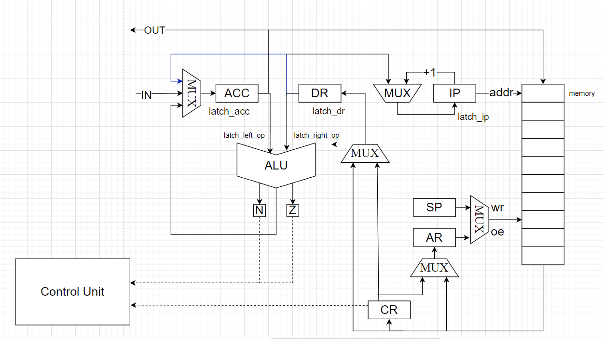

# Лабораторная работа №3.
___
- Бугаев Сергей Юрьевич
- `alg | acc | neum | mc | tick | struct | stream | port | cstr | prob1 | 8bit`
- Без усложнения

**Описание варианта**
- **alg** -- синтаксис языка должен напоминать java/javascript/lua. Должен поддерживать математические выражения.
- **acc** -- система команд должна быть выстроена вокруг аккумулятора.
  - Инструкции -- изменяют значение, хранимое в аккумуляторе.  
  - Ввод-вывод осуществляется через аккумулятор.
- **neum** -- фон Неймановская архитектура.
- **mc** -- microcoded.
- **tick** -- процессор необходимо моделировать с точностью до такта, процесс моделирования может быть приостановлен на любом такте
- **struct** -- машинный код в виде высокоуровневой структуры данных. Считается, что одна инструкция укладывается в одно машинное слово.
- **stream** -- Ввод-вывод осуществляется как поток токенов.
- **port** -- port-mapped (специальные инструкции для ввода-вывода)
- **cstr** -- Null-terminated (C string)
- **prob1** -- Multiples of 3 or 5
- **8bit** -- машинное слово -- 8 бит (как для памяти команд, так и для памяти данных, если они разделены). - **не реализовано**
___

## Язык программирования

- Описание синтаксиса:
```
<program> ::= <program_line> {<program>}

<program_line> ::= <variable declaration> | <conditional operator> | <loop> | <input> | <output>

<variable declaration> ::= [<type>] ["{"<integer constant>"}"] <identifier> "=" <expression> ;

<type> :: = int | str

<id> ::= {<letter>}

<expression> ::= <arithmetic expression> | <id> | <literal>

<conditional operator> ::= if "(" <logical mapping> ")" "{"<telo_operator> "}"

<boolean expression> ::= (<identifier> (< | > | == ) < integer constant>) | (<identifier> % <integer constant> == <integer constant>)

<loop> ::= while ( <logical mapping> ) { <operator's phone number> }

<operator's phone number> ::= <program>

<arithmetic expression> ::= <term> { ( + | - | * | /) <arithmetic expression> }

<term> ::= <identifier> | <literal>

<literal> ::= <integer constant> | <string>

<integer constant> ::= <digit>+

<input> ::= read(<id>);

<output> ::= print(<id>|<string>);

<string> ::='{<any_ character>}'

<any_ character> ::= <letter> | <number> | ...

<letter> ::= a | ... | A ... | Z

<digit> ::= 0 | ... | 9
```
**Описание**
- Область видимости: Глобальная
- Статическая типизация.
- Типы данных включают в себя int, str.
- Виды литералов:
  - Целочисленные: 123
  - Строки: 'hello'
- Переменные хранятся на стеке

## Организация памяти

```
               Registers
+------------------------------------+
| ACC - аккумулятор                  |
+------------------------------------+
| CR - регистр инструкции            |
+------------------------------------+
| DR - регистр данных                |
+------------------------------------+
| IP - счётчик команд                |
+------------------------------------+
| SP - указатель стека               |
+------------------------------------+
| AR - адрес записи в память         |
+------------------------------------+

```
- Память данных и команд общая (фон Нейман)
- Виды адресации:
    - абсолютная
    - непосредственная адресация
    - косвенная
- Назначение регистров
    - ACC -- главный регистр (аккумуляторная архитектура), содержит результаты всех операций, ввод-вывод реализуется с него
    - CR -- содержит текущую выполняемую инструкцию
    - DR -- вспомомогательный регистр
    - IP -- содержит адрес следующей инструкции, которая должна быть выполнена
    - SP -- Указтаель на вершину стека
    - AR -- содержит адрес, по которому произойдет запись или чтение из памяти
- Циклы выполнения команды:
  - Цикл выборки инструкции: 1 такт
  - Цикл выборки операнда: 2-3 такта (Зависит от вида адресации)
  - Цикл выполнения команды: 1-3 такта
- Константы отсутствуют в языке
- В одном машинном слове хранится 1 символ строкового литерала
- Переменные помещаются на стек
### Работа со строковыми литералами:
- Строковые литералы хранятся в памяти последовательно
- Если встречается команда print('some'); -- символы внутри print после трансляции хранятся последовательно и представлены командой NOP
- Если встречается конструкция str[number] some_str = 'some' -- в памяти после всех инструкций или после последнего строкового литерала выделяется память длиной number
- Если встречается коснтрукция str some_str = 'some' --в памяти после всех инструкций или после последнего строкового литерала выделяется память длиной строки
- Конструкция str[number] требуется для корректной работы со считыванием данных, так как шанс затирания последующих данных снижается

## Система команд

Особенности процессора:

- Доступ к вводу-выводу происходит через специальные команды READ  (1 - Порт для буффера, 2 - Порт для вывода), порты конфигурируются в [isa](machine/isa.py)

Цикл команды:

- Выборка инструкции -- mem[IP] -> CR, IP+1 -> IP
- Выборка операнда --
  - addr-> AR, mem[AR] -> DR (Абсолютная);
  - addr -> DR (Непосредственная);
  - addr -> AR, mem[AR] -> AR, mem[AR] -> DR (косвенная)
- Выполнение команды 


### Набор инструкций

| Инструкция         | Описание                                                                         |
|:-------------------|:---------------------------------------------------------------------------------|
| ST `<addr>`        | Сохранить в память значение из аккумулятора                                      |
| LD  `<addr>`       | Загрузить в аккумулятор значение из памяти                                       |
| ADD `<addr>`       | Сложить значение аккумулятора с значением из памяти, записать в аккумулятор      |
| SUB `<addr>`       | Вычесть из значения аккумулятора значение из памяти, записать в аккумулятор      |
| MUL `<addr>`       | Умножить значение аккумулятора на значение из памяти, записать в аккумулятор     |
| DIV `<addr>`       | Поделить значение аккумулятора на значение из памяти, записать в аккумулятор     |
| JUMP `<addr>`      | перейти по адресу                                                                |
| PUSH               | Сохранить в стек значение аккумулятора                                           |
| NOP                | отсутствие операции                                                              |
| POP                | Загрузить в аккумулятор значение со стека                                        | 
| CMP `<addr>`       | Выставить значения флагов при сравнении аккумулятора и значения из памяти        | 
| JE `<addr>`        | перейти по адресу, если флаг Z == 1                                              |
| JNE `<addr>`       | перейти по адресу, если флаг Z == 0                                              |              
| JA `<addr>`        | перейти по адресу, если флаг N == 0                                              |
| JB `<addr>`        | перейти по адресу, если флаг N == 1                                              |
| HALT               | Остановка симуляции                                                              |
| INC                | Прибавить к аккумулятору 1                                                       |

- `<addr>` -- абсолютная/косвенная/непосредственная адресация

### Кодирование инструкций

- Машинный код сереализуется в список JSON
- Один элемент списка -- одна инструкция

Пример:

```json
[
    {
        "index": 0,
        "opcode": "Opcode.JUMP",
        "arg1": "#",
        "arg2": 14
    }
]
```

где:

- `index` -- адрес в памяти
- `opcode` -- код операции
- `arg1` -- вид адрессации
- `arg2` -- аргумент

Типы данных в модуле [isa](machine/isa.py), где:

- `Opcode` -- перечисление кодов операций
- 'TypesOfAddressing' -- доступные виды адресации 
## Транслятор

Интерфейс командной строки: `translator.py <input_file> <target_file>`

Реализовано в модуле: [translator](translator/translate.py)

Этапы трансляции:
Трансляция происходит в 3 шага:
1. [Lexer](translator/lexer.py) - разбивает код из <input_file> на токены
2. [AST](translator/ast.py) - используя токены, строит AST
3. [translator](translator/translate.py) - используя AST, создаётся машинный код, записывает в виде json в <target_file>

## Модель процессора

Интерфейс командной строки: `machine.py <machine_code_file> <input_file>`

Реализовано в модуле: [machine](machine/processor.py).

**Datapath**



Реализован в [machine](machine/data_path.py).

Регистры (соответствуют регистрам на схеме):

- `ACC`
- `DR`
- `CR`
- `AR`
- `SP`
- `IP`


Сигналы:
- `latch_ar` -- защелкнуть адресный регистр (addr->AR | mem[AR] -> AR)
- `latch_acc` -- защелкнуть аккумулятор (DR -> ACC | ALU_result -> ACC | mem[sp] -> ACC)
- `latch_ip` -- защелкнуть счетчик команд ( IP+1 -> IP | DR->IP)
- `latch_sp` -- защелкнуть регистр стека (SP+1-> SP | SP-1 -> SP)
- `latch_dr` -- защелкнуть регистр данных
- `latch_cr` -- защелкнуть регистр команд mem[IP] -> CR
- `latch_left_op` -- ACC -> left_operand
- `latch_right_op` -- ACC -> right_operand
- `signal_wr` -- запись в память ACC
- `calculate` -- выполнить операцию на АЛУ
- `get_flags` -- Получить флаги с АЛУ

Селекторы для мультиплексоров реализованы с помощью Enum в [machine](machine/data_path.py) классом Selector

Флаги:
- `N` (negative) -- результат в алу содержит отрицательное число
- `Z` (zero) -- результат в алу содержит ноль

**ControlUnit**


Реализован в [machine](machine/control_unit.py).

- Выполняет микрокод:
  - Включает в себя сигналы и мультиплексоры для DataPath
  - Хранится в отдельной памяти в Control Unit
  - Названия каждобого бита:
    - **latch_cr** -- защелкнуть адресный регистр
    - **sel_ip** -- Мультиплексор для ip
    - **latch_ip** -- защелкнуть счетчик команд
    - **sel_ar**  -- Мультиплексор для ar
    - **latch_ar** -- защелкнуть адресный регистр
    - **sel_oe** -- Мультиплексор для oe
    - **signal_oe** -- сигнал для чтения
    - **sel_dr** -- Мультиплексор для dr
    - **latch_dr** -- защелкнуть регистр данных
    - **latch_left_op** -- -- ACC -> left_operand
    - **latch_right_op** -- ACC -> right_operand
    - **signal_calculate** -- выполнить операцию на АЛУ
    - **check_flags** -- проверка флагов
    - **sel_acc** -- Мультиплексор для acc
    - **latch_acc** -- защелкнуть аккумулятор
    - **sel_wr** -- Мультиплексор для wr
    - **signal_wr**  -- сигнал на запись в память
    - **sel_sp** -- Мультиплексор для sp
    - **latch_sp** - защелкнуть SP
    - **latch_out** -- Запись в порт для выхода
    - **mux_port** -- Выбор порта 
    - **latch_in** -- Запись в порт для входа
    - **mux_mPC** -- 3 возможных значения
      - +1 -- переход к следующей микрокоманде
      - 0 -- переход к 0 микрокоманде
      - decode - декодировать следующую команду
    - **latch_mPC** -- защёлкнуть счётчик микрокоманд
- Метод `process_tick` моделирует выполнение следующего такта
- Для журнала состояний процессора используется стандартный модуль `logging`
- Каждая запись в журнале соответсвует состоянию процессора **после** выполнения инструкции
- Количество инструкций для моделирования лимитировано
- Остановка моделирования осуществляется при:
    - превышении лимита количества тактов
    - исключении `HaltError` (команда `halt`)
    - Попытке получить данные из пустого буфера

## Тестирование

Реализованные программы:

1. [hello_world](./examples/hello_world.lab3) -- печатаем 'Hello, World!'
1. [cat](./examples/cat.lab3) --  программа cat, повторяем ввод на выводе
1. [hello_usr](./examples/hello_user.lab3) -- запросить у пользователя его имя, считать его, вывести на экран приветствие
1. [prob2](./examples/prob1.lab3) --  сумма всех чисел, кратных 3 или 5, меньше 1000.

Интеграционные тесты реализованы в [integration_test](./integration_test.py):

- Стратегия: golden tests, конфигурация в папке [golden/](./golden/)

CI при помощи Github Action:

```yaml
defaults:
  run:
    working-directory: ./

jobs:
  test:
    runs-on: ubuntu-latest

    steps:
      - name: Checkout code
        uses: actions/checkout@v4

      - name: Set up Python
        uses: actions/setup-python@v4
        with:
          python-version: 3.11

      - name: Install dependencies
        run: |
          python -m pip install --upgrade pip
          pip install poetry
          poetry install

      - name: Run tests and collect coverage
        run: |
          poetry run coverage run -m pytest .
          poetry run coverage report -m
        env:
          CI: true

  lint:
    runs-on: ubuntu-latest

    steps:
      - name: Checkout code
        uses: actions/checkout@v4

      - name: Set up Python
        uses: actions/setup-python@v4
        with:
          python-version: 3.11

      - name: Install dependencies
        run: |
          python -m pip install --upgrade pip
          pip install poetry
          poetry install

      - name: Check code formatting with Ruff
        run: poetry run ruff format --check .

      - name: Run Ruff linters
        run: poetry run ruff check .
```

Пример использования и журнал работы процессора на примере hello_world

- Код:
  int n = 0;
  str a[20]= '';
  read(n);
  while (n>0) {
      a = a + n;
      read(n);
  }
  print(a);

- Машинный код:
```
[{"index": 0, "opcode": "Opcode.LD", "arg1": "#", "arg2": 0},
{"index": 1, "opcode": "Opcode.PUSH", "arg1": null, "arg2": null},
{"index": 2, "opcode": "Opcode.LD", "arg1": "#", "arg2": 4097},
{"index": 3, "opcode": "Opcode.PUSH", "arg1": null, "arg2": null},
{"index": 4, "opcode": "Opcode.LD", "arg1": "#", "arg2": 0},
{"index": 5, "opcode": "Opcode.ST", "arg1": "=", "arg2": 4097},
{"index": 6, "opcode": "Opcode.READ", "arg1": null, "arg2": 1},
{"index": 7, "opcode": "Opcode.ST", "arg1": "=", "arg2": 8095},
{"index": 8, "opcode": "Opcode.LD", "arg1": "=", "arg2": 8095},
{"index": 9, "opcode": "Opcode.CMP", "arg1": "#", "arg2": 0},
{"index": 10, "opcode": "Opcode.JB", "arg1": "#", "arg2": 26},
{"index": 11, "opcode": "Opcode.LD", "arg1": "#", "arg2": 4097},
{"index": 12, "opcode": "Opcode.PUSH", "arg1": null, "arg2": null},
{"index": 13, "opcode": "Opcode.LD", "arg1": "~", "arg2": 8093},
{"index": 14, "opcode": "Opcode.CMP", "arg1": "#", "arg2": 0},
{"index": 15, "opcode": "Opcode.JE", "arg1": "#", "arg2": 20},
{"index": 16, "opcode": "Opcode.POP", "arg1": null, "arg2": null},
{"index": 17, "opcode": "Opcode.INC", "arg1": null, "arg2": null},
{"index": 18, "opcode": "Opcode.PUSH", "arg1": null, "arg2": null},
{"index": 19, "opcode": "Opcode.JUMP", "arg1": "#", "arg2": 13},
{"index": 20, "opcode": "Opcode.LD", "arg1": "=", "arg2": 8095},
{"index": 21, "opcode": "Opcode.ST", "arg1": "~", "arg2": 8093},
{"index": 22, "opcode": "Opcode.POP", "arg1": null, "arg2": null},
{"index": 23, "opcode": "Opcode.READ", "arg1": null, "arg2": 1},
{"index": 24, "opcode": "Opcode.ST", "arg1": "=", "arg2": 8095},
{"index": 25, "opcode": "Opcode.JUMP", "arg1": "#", "arg2": 8},
{"index": 26, "opcode": "Opcode.LD", "arg1": "#", "arg2": 4097},
{"index": 27, "opcode": "Opcode.PUSH", "arg1": null, "arg2": null},
{"index": 28, "opcode": "Opcode.LD", "arg1": "~", "arg2": 8093},
{"index": 29, "opcode": "Opcode.PRINT", "arg1": null, "arg2": 2},
{"index": 30, "opcode": "Opcode.CMP", "arg1": "#", "arg2": 0},
{"index": 31, "opcode": "Opcode.JE", "arg1": "#", "arg2": 36},
{"index": 32, "opcode": "Opcode.POP", "arg1": null, "arg2": null},
{"index": 33, "opcode": "Opcode.INC", "arg1": null, "arg2": null},
{"index": 34, "opcode": "Opcode.PUSH", "arg1": null, "arg2": null},
{"index": 35, "opcode": "Opcode.JUMP", "arg1": "#", "arg2": 28},
{"index": 36, "opcode": "Opcode.POP", "arg1": null, "arg2": null},
{"index": 37, "opcode": "Opcode.HALT", "arg1": null, "arg2": null}]
```

- Вывод программы:
hello world!

- Журнал работы:
```
INFO    processor:simulation    Simulation start
INFO    controlunit:microcode_handler execute_command       Opcode.LD | tick:          4 | ip:          1 | dr          0 |ar:          0 | acc:          0 | sp:       8095
INFO    controlunit:microcode_handler execute_command     Opcode.PUSH | tick:          7 | ip:          2 | dr          0 |ar:          0 | acc:          0 | sp:       8094
INFO    controlunit:microcode_handler execute_command       Opcode.LD | tick:         11 | ip:          3 | dr       4097 |ar:          0 | acc:       4097 | sp:       8094
INFO    controlunit:microcode_handler execute_command     Opcode.PUSH | tick:         14 | ip:          4 | dr       4097 |ar:          0 | acc:       4097 | sp:       8093
INFO    controlunit:microcode_handler execute_command       Opcode.LD | tick:         18 | ip:          5 | dr          0 |ar:          0 | acc:          0 | sp:       8093
INFO    controlunit:microcode_handler execute_command       Opcode.ST | tick:         23 | ip:          6 | dr          0 |ar:       4097 | acc:          0 | sp:       8093
DEBUG   datapath:get_char_from_device INPUT-> D
INFO    controlunit:microcode_handler execute_command     Opcode.READ | tick:         27 | ip:          7 | dr          0 |ar:       4097 | acc:         68 | sp:       8093
INFO    controlunit:microcode_handler execute_command       Opcode.ST | tick:         32 | ip:          8 | dr          0 |ar:       8095 | acc:         68 | sp:       8093
INFO    controlunit:microcode_handler execute_command       Opcode.LD | tick:         37 | ip:          9 | dr         68 |ar:       8095 | acc:         68 | sp:       8093
INFO    controlunit:microcode_handler execute_command      Opcode.CMP | tick:         41 | ip:         10 | dr          0 |ar:       8095 | acc:         68 | sp:       8093
INFO    controlunit:microcode_handler execute_command       Opcode.JB | tick:         45 | ip:         11 | dr         26 |ar:       8095 | acc:         68 | sp:       8093
INFO    controlunit:microcode_handler execute_command       Opcode.LD | tick:         49 | ip:         12 | dr       4097 |ar:       8095 | acc:       4097 | sp:       8093
INFO    controlunit:microcode_handler execute_command     Opcode.PUSH | tick:         52 | ip:         13 | dr       4097 |ar:       8095 | acc:       4097 | sp:       8092
INFO    controlunit:microcode_handler execute_command       Opcode.LD | tick:         58 | ip:         14 | dr          0 |ar:       4097 | acc:          0 | sp:       8092
INFO    controlunit:microcode_handler execute_command      Opcode.CMP | tick:         62 | ip:         15 | dr          0 |ar:       4097 | acc:          0 | sp:       8092
INFO    controlunit:microcode_handler execute_command       Opcode.JE | tick:         67 | ip:         20 | dr         20 |ar:       4097 | acc:          0 | sp:       8092
INFO    controlunit:microcode_handler execute_command       Opcode.LD | tick:         72 | ip:         21 | dr         68 |ar:       8095 | acc:         68 | sp:       8092
INFO    controlunit:microcode_handler execute_command       Opcode.ST | tick:         78 | ip:         22 | dr          0 |ar:       4097 | acc:         68 | sp:       8092
INFO    controlunit:microcode_handler execute_command      Opcode.POP | tick:         83 | ip:         23 | dr       4097 |ar:       4097 | acc:       4097 | sp:       8093
DEBUG   datapath:get_char_from_device INPUT-> m
INFO    controlunit:microcode_handler execute_command     Opcode.READ | tick:         87 | ip:         24 | dr       4097 |ar:       4097 | acc:        109 | sp:       8093
INFO    controlunit:microcode_handler execute_command       Opcode.ST | tick:         92 | ip:         25 | dr         68 |ar:       8095 | acc:        109 | sp:       8093
INFO    controlunit:microcode_handler execute_command     Opcode.JUMP | tick:         96 | ip:          8 | dr          8 |ar:       8095 | acc:        109 | sp:       8093
INFO    controlunit:microcode_handler execute_command       Opcode.LD | tick:        101 | ip:          9 | dr        109 |ar:       8095 | acc:        109 | sp:       8093
INFO    controlunit:microcode_handler execute_command      Opcode.CMP | tick:        105 | ip:         10 | dr          0 |ar:       8095 | acc:        109 | sp:       8093
INFO    controlunit:microcode_handler execute_command       Opcode.JB | tick:        109 | ip:         11 | dr         26 |ar:       8095 | acc:        109 | sp:       8093
INFO    controlunit:microcode_handler execute_command       Opcode.LD | tick:        113 | ip:         12 | dr       4097 |ar:       8095 | acc:       4097 | sp:       8093
INFO    controlunit:microcode_handler execute_command     Opcode.PUSH | tick:        116 | ip:         13 | dr       4097 |ar:       8095 | acc:       4097 | sp:       8092
INFO    controlunit:microcode_handler execute_command       Opcode.LD | tick:        122 | ip:         14 | dr         68 |ar:       4097 | acc:         68 | sp:       8092
INFO    controlunit:microcode_handler execute_command      Opcode.CMP | tick:        126 | ip:         15 | dr          0 |ar:       4097 | acc:         68 | sp:       8092
INFO    controlunit:microcode_handler execute_command       Opcode.JE | tick:        130 | ip:         16 | dr         20 |ar:       4097 | acc:         68 | sp:       8092
INFO    controlunit:microcode_handler execute_command      Opcode.POP | tick:        135 | ip:         17 | dr       4097 |ar:       4097 | acc:       4097 | sp:       8093
INFO    controlunit:microcode_handler execute_command      Opcode.INC | tick:        138 | ip:         18 | dr       4097 |ar:       4097 | acc:       4098 | sp:       8093
INFO    controlunit:microcode_handler execute_command     Opcode.PUSH | tick:        141 | ip:         19 | dr       4097 |ar:       4097 | acc:       4098 | sp:       8092
INFO    controlunit:microcode_handler execute_command     Opcode.JUMP | tick:        145 | ip:         13 | dr         13 |ar:       4097 | acc:       4098 | sp:       8092
INFO    controlunit:microcode_handler execute_command       Opcode.LD | tick:        151 | ip:         14 | dr          0 |ar:       4098 | acc:          0 | sp:       8092
INFO    controlunit:microcode_handler execute_command      Opcode.CMP | tick:        155 | ip:         15 | dr          0 |ar:       4098 | acc:          0 | sp:       8092
INFO    controlunit:microcode_handler execute_command       Opcode.JE | tick:        160 | ip:         20 | dr         20 |ar:       4098 | acc:          0 | sp:       8092
INFO    controlunit:microcode_handler execute_command       Opcode.LD | tick:        165 | ip:         21 | dr        109 |ar:       8095 | acc:        109 | sp:       8092
INFO    controlunit:microcode_handler execute_command       Opcode.ST | tick:        171 | ip:         22 | dr          0 |ar:       4098 | acc:        109 | sp:       8092
INFO    controlunit:microcode_handler execute_command      Opcode.POP | tick:        176 | ip:         23 | dr       4098 |ar:       4098 | acc:       4098 | sp:       8093
DEBUG   datapath:get_char_from_device INPUT-> i
INFO    controlunit:microcode_handler execute_command     Opcode.READ | tick:        180 | ip:         24 | dr       4098 |ar:       4098 | acc:        105 | sp:       8093
INFO    controlunit:microcode_handler execute_command       Opcode.ST | tick:        185 | ip:         25 | dr        109 |ar:       8095 | acc:        105 | sp:       8093
INFO    controlunit:microcode_handler execute_command     Opcode.JUMP | tick:        189 | ip:          8 | dr          8 |ar:       8095 | acc:        105 | sp:       8093
INFO    controlunit:microcode_handler execute_command       Opcode.LD | tick:        194 | ip:          9 | dr        105 |ar:       8095 | acc:        105 | sp:       8093
INFO    controlunit:microcode_handler execute_command      Opcode.CMP | tick:        198 | ip:         10 | dr          0 |ar:       8095 | acc:        105 | sp:       8093
INFO    controlunit:microcode_handler execute_command       Opcode.JB | tick:        202 | ip:         11 | dr         26 |ar:       8095 | acc:        105 | sp:       8093
INFO    controlunit:microcode_handler execute_command       Opcode.LD | tick:        206 | ip:         12 | dr       4097 |ar:       8095 | acc:       4097 | sp:       8093
INFO    controlunit:microcode_handler execute_command     Opcode.PUSH | tick:        209 | ip:         13 | dr       4097 |ar:       8095 | acc:       4097 | sp:       8092
INFO    controlunit:microcode_handler execute_command       Opcode.LD | tick:        215 | ip:         14 | dr         68 |ar:       4097 | acc:         68 | sp:       8092
INFO    controlunit:microcode_handler execute_command      Opcode.CMP | tick:        219 | ip:         15 | dr          0 |ar:       4097 | acc:         68 | sp:       8092
INFO    controlunit:microcode_handler execute_command       Opcode.JE | tick:        223 | ip:         16 | dr         20 |ar:       4097 | acc:         68 | sp:       8092
INFO    controlunit:microcode_handler execute_command      Opcode.POP | tick:        228 | ip:         17 | dr       4097 |ar:       4097 | acc:       4097 | sp:       8093
INFO    controlunit:microcode_handler execute_command      Opcode.INC | tick:        231 | ip:         18 | dr       4097 |ar:       4097 | acc:       4098 | sp:       8093
INFO    controlunit:microcode_handler execute_command     Opcode.PUSH | tick:        234 | ip:         19 | dr       4097 |ar:       4097 | acc:       4098 | sp:       8092
INFO    controlunit:microcode_handler execute_command     Opcode.JUMP | tick:        238 | ip:         13 | dr         13 |ar:       4097 | acc:       4098 | sp:       8092
INFO    controlunit:microcode_handler execute_command       Opcode.LD | tick:        244 | ip:         14 | dr        109 |ar:       4098 | acc:        109 | sp:       8092
INFO    controlunit:microcode_handler execute_command      Opcode.CMP | tick:        248 | ip:         15 | dr          0 |ar:       4098 | acc:        109 | sp:       8092
INFO    controlunit:microcode_handler execute_command       Opcode.JE | tick:        252 | ip:         16 | dr         20 |ar:       4098 | acc:        109 | sp:       8092
INFO    controlunit:microcode_handler execute_command      Opcode.POP | tick:        257 | ip:         17 | dr       4098 |ar:       4098 | acc:       4098 | sp:       8093
INFO    controlunit:microcode_handler execute_command      Opcode.INC | tick:        260 | ip:         18 | dr       4098 |ar:       4098 | acc:       4099 | sp:       8093
INFO    controlunit:microcode_handler execute_command     Opcode.PUSH | tick:        263 | ip:         19 | dr       4098 |ar:       4098 | acc:       4099 | sp:       8092
INFO    controlunit:microcode_handler execute_command     Opcode.JUMP | tick:        267 | ip:         13 | dr         13 |ar:       4098 | acc:       4099 | sp:       8092
INFO    controlunit:microcode_handler execute_command       Opcode.LD | tick:        273 | ip:         14 | dr          0 |ar:       4099 | acc:          0 | sp:       8092
INFO    controlunit:microcode_handler execute_command      Opcode.CMP | tick:        277 | ip:         15 | dr          0 |ar:       4099 | acc:          0 | sp:       8092
INFO    controlunit:microcode_handler execute_command       Opcode.JE | tick:        282 | ip:         20 | dr         20 |ar:       4099 | acc:          0 | sp:       8092
INFO    controlunit:microcode_handler execute_command       Opcode.LD | tick:        287 | ip:         21 | dr        105 |ar:       8095 | acc:        105 | sp:       8092
INFO    controlunit:microcode_handler execute_command       Opcode.ST | tick:        293 | ip:         22 | dr          0 |ar:       4099 | acc:        105 | sp:       8092
INFO    controlunit:microcode_handler execute_command      Opcode.POP | tick:        298 | ip:         23 | dr       4099 |ar:       4099 | acc:       4099 | sp:       8093
DEBUG   datapath:get_char_from_device INPUT-> t
INFO    controlunit:microcode_handler execute_command     Opcode.READ | tick:        302 | ip:         24 | dr       4099 |ar:       4099 | acc:        116 | sp:       8093
INFO    controlunit:microcode_handler execute_command       Opcode.ST | tick:        307 | ip:         25 | dr        105 |ar:       8095 | acc:        116 | sp:       8093
INFO    controlunit:microcode_handler execute_command     Opcode.JUMP | tick:        311 | ip:          8 | dr          8 |ar:       8095 | acc:        116 | sp:       8093
INFO    controlunit:microcode_handler execute_command       Opcode.LD | tick:        316 | ip:          9 | dr        116 |ar:       8095 | acc:        116 | sp:       8093
INFO    controlunit:microcode_handler execute_command      Opcode.CMP | tick:        320 | ip:         10 | dr          0 |ar:       8095 | acc:        116 | sp:       8093
INFO    controlunit:microcode_handler execute_command       Opcode.JB | tick:        324 | ip:         11 | dr         26 |ar:       8095 | acc:        116 | sp:       8093
INFO    controlunit:microcode_handler execute_command       Opcode.LD | tick:        328 | ip:         12 | dr       4097 |ar:       8095 | acc:       4097 | sp:       8093
INFO    controlunit:microcode_handler execute_command     Opcode.PUSH | tick:        331 | ip:         13 | dr       4097 |ar:       8095 | acc:       4097 | sp:       8092
INFO    controlunit:microcode_handler execute_command       Opcode.LD | tick:        337 | ip:         14 | dr         68 |ar:       4097 | acc:         68 | sp:       8092
INFO    controlunit:microcode_handler execute_command      Opcode.CMP | tick:        341 | ip:         15 | dr          0 |ar:       4097 | acc:         68 | sp:       8092
INFO    controlunit:microcode_handler execute_command       Opcode.JE | tick:        345 | ip:         16 | dr         20 |ar:       4097 | acc:         68 | sp:       8092
INFO    controlunit:microcode_handler execute_command      Opcode.POP | tick:        350 | ip:         17 | dr       4097 |ar:       4097 | acc:       4097 | sp:       8093
INFO    controlunit:microcode_handler execute_command      Opcode.INC | tick:        353 | ip:         18 | dr       4097 |ar:       4097 | acc:       4098 | sp:       8093
INFO    controlunit:microcode_handler execute_command     Opcode.PUSH | tick:        356 | ip:         19 | dr       4097 |ar:       4097 | acc:       4098 | sp:       8092
INFO    controlunit:microcode_handler execute_command     Opcode.JUMP | tick:        360 | ip:         13 | dr         13 |ar:       4097 | acc:       4098 | sp:       8092
INFO    controlunit:microcode_handler execute_command       Opcode.LD | tick:        366 | ip:         14 | dr        109 |ar:       4098 | acc:        109 | sp:       8092
INFO    controlunit:microcode_handler execute_command      Opcode.CMP | tick:        370 | ip:         15 | dr          0 |ar:       4098 | acc:        109 | sp:       8092
INFO    controlunit:microcode_handler execute_command       Opcode.JE | tick:        374 | ip:         16 | dr         20 |ar:       4098 | acc:        109 | sp:       8092
INFO    controlunit:microcode_handler execute_command      Opcode.POP | tick:        379 | ip:         17 | dr       4098 |ar:       4098 | acc:       4098 | sp:       8093
INFO    controlunit:microcode_handler execute_command      Opcode.INC | tick:        382 | ip:         18 | dr       4098 |ar:       4098 | acc:       4099 | sp:       8093
INFO    controlunit:microcode_handler execute_command     Opcode.PUSH | tick:        385 | ip:         19 | dr       4098 |ar:       4098 | acc:       4099 | sp:       8092
INFO    controlunit:microcode_handler execute_command     Opcode.JUMP | tick:        389 | ip:         13 | dr         13 |ar:       4098 | acc:       4099 | sp:       8092
INFO    controlunit:microcode_handler execute_command       Opcode.LD | tick:        395 | ip:         14 | dr        105 |ar:       4099 | acc:        105 | sp:       8092
INFO    controlunit:microcode_handler execute_command      Opcode.CMP | tick:        399 | ip:         15 | dr          0 |ar:       4099 | acc:        105 | sp:       8092
INFO    controlunit:microcode_handler execute_command       Opcode.JE | tick:        403 | ip:         16 | dr         20 |ar:       4099 | acc:        105 | sp:       8092
INFO    controlunit:microcode_handler execute_command      Opcode.POP | tick:        408 | ip:         17 | dr       4099 |ar:       4099 | acc:       4099 | sp:       8093
INFO    controlunit:microcode_handler execute_command      Opcode.INC | tick:        411 | ip:         18 | dr       4099 |ar:       4099 | acc:       4100 | sp:       8093
INFO    controlunit:microcode_handler execute_command     Opcode.PUSH | tick:        414 | ip:         19 | dr       4099 |ar:       4099 | acc:       4100 | sp:       8092
INFO    controlunit:microcode_handler execute_command     Opcode.JUMP | tick:        418 | ip:         13 | dr         13 |ar:       4099 | acc:       4100 | sp:       8092
INFO    controlunit:microcode_handler execute_command       Opcode.LD | tick:        424 | ip:         14 | dr          0 |ar:       4100 | acc:          0 | sp:       8092
INFO    controlunit:microcode_handler execute_command      Opcode.CMP | tick:        428 | ip:         15 | dr          0 |ar:       4100 | acc:          0 | sp:       8092
INFO    controlunit:microcode_handler execute_command       Opcode.JE | tick:        433 | ip:         20 | dr         20 |ar:       4100 | acc:          0 | sp:       8092
INFO    controlunit:microcode_handler execute_command       Opcode.LD | tick:        438 | ip:         21 | dr        116 |ar:       8095 | acc:        116 | sp:       8092
INFO    controlunit:microcode_handler execute_command       Opcode.ST | tick:        444 | ip:         22 | dr          0 |ar:       4100 | acc:        116 | sp:       8092
INFO    controlunit:microcode_handler execute_command      Opcode.POP | tick:        449 | ip:         23 | dr       4100 |ar:       4100 | acc:       4100 | sp:       8093
DEBUG   datapath:get_char_from_device INPUT-> r
INFO    controlunit:microcode_handler execute_command     Opcode.READ | tick:        453 | ip:         24 | dr       4100 |ar:       4100 | acc:        114 | sp:       8093
INFO    controlunit:microcode_handler execute_command       Opcode.ST | tick:        458 | ip:         25 | dr        116 |ar:       8095 | acc:        114 | sp:       8093
INFO    controlunit:microcode_handler execute_command     Opcode.JUMP | tick:        462 | ip:          8 | dr          8 |ar:       8095 | acc:        114 | sp:       8093
INFO    controlunit:microcode_handler execute_command       Opcode.LD | tick:        467 | ip:          9 | dr        114 |ar:       8095 | acc:        114 | sp:       8093
INFO    controlunit:microcode_handler execute_command      Opcode.CMP | tick:        471 | ip:         10 | dr          0 |ar:       8095 | acc:        114 | sp:       8093
INFO    controlunit:microcode_handler execute_command       Opcode.JB | tick:        475 | ip:         11 | dr         26 |ar:       8095 | acc:        114 | sp:       8093
INFO    controlunit:microcode_handler execute_command       Opcode.LD | tick:        479 | ip:         12 | dr       4097 |ar:       8095 | acc:       4097 | sp:       8093
INFO    controlunit:microcode_handler execute_command     Opcode.PUSH | tick:        482 | ip:         13 | dr       4097 |ar:       8095 | acc:       4097 | sp:       8092
INFO    controlunit:microcode_handler execute_command       Opcode.LD | tick:        488 | ip:         14 | dr         68 |ar:       4097 | acc:         68 | sp:       8092
INFO    controlunit:microcode_handler execute_command      Opcode.CMP | tick:        492 | ip:         15 | dr          0 |ar:       4097 | acc:         68 | sp:       8092
INFO    controlunit:microcode_handler execute_command       Opcode.JE | tick:        496 | ip:         16 | dr         20 |ar:       4097 | acc:         68 | sp:       8092
INFO    controlunit:microcode_handler execute_command      Opcode.POP | tick:        501 | ip:         17 | dr       4097 |ar:       4097 | acc:       4097 | sp:       8093
INFO    controlunit:microcode_handler execute_command      Opcode.INC | tick:        504 | ip:         18 | dr       4097 |ar:       4097 | acc:       4098 | sp:       8093
INFO    controlunit:microcode_handler execute_command     Opcode.PUSH | tick:        507 | ip:         19 | dr       4097 |ar:       4097 | acc:       4098 | sp:       8092
INFO    controlunit:microcode_handler execute_command     Opcode.JUMP | tick:        511 | ip:         13 | dr         13 |ar:       4097 | acc:       4098 | sp:       8092
INFO    controlunit:microcode_handler execute_command       Opcode.LD | tick:        517 | ip:         14 | dr        109 |ar:       4098 | acc:        109 | sp:       8092
INFO    controlunit:microcode_handler execute_command      Opcode.CMP | tick:        521 | ip:         15 | dr          0 |ar:       4098 | acc:        109 | sp:       8092
INFO    controlunit:microcode_handler execute_command       Opcode.JE | tick:        525 | ip:         16 | dr         20 |ar:       4098 | acc:        109 | sp:       8092
INFO    controlunit:microcode_handler execute_command      Opcode.POP | tick:        530 | ip:         17 | dr       4098 |ar:       4098 | acc:       4098 | sp:       8093
INFO    controlunit:microcode_handler execute_command      Opcode.INC | tick:        533 | ip:         18 | dr       4098 |ar:       4098 | acc:       4099 | sp:       8093
INFO    controlunit:microcode_handler execute_command     Opcode.PUSH | tick:        536 | ip:         19 | dr       4098 |ar:       4098 | acc:       4099 | sp:       8092
INFO    controlunit:microcode_handler execute_command     Opcode.JUMP | tick:        540 | ip:         13 | dr         13 |ar:       4098 | acc:       4099 | sp:       8092
INFO    controlunit:microcode_handler execute_command       Opcode.LD | tick:        546 | ip:         14 | dr        105 |ar:       4099 | acc:        105 | sp:       8092
INFO    controlunit:microcode_handler execute_command      Opcode.CMP | tick:        550 | ip:         15 | dr          0 |ar:       4099 | acc:        105 | sp:       8092
INFO    controlunit:microcode_handler execute_command       Opcode.JE | tick:        554 | ip:         16 | dr         20 |ar:       4099 | acc:        105 | sp:       8092
INFO    controlunit:microcode_handler execute_command      Opcode.POP | tick:        559 | ip:         17 | dr       4099 |ar:       4099 | acc:       4099 | sp:       8093
INFO    controlunit:microcode_handler execute_command      Opcode.INC | tick:        562 | ip:         18 | dr       4099 |ar:       4099 | acc:       4100 | sp:       8093
INFO    controlunit:microcode_handler execute_command     Opcode.PUSH | tick:        565 | ip:         19 | dr       4099 |ar:       4099 | acc:       4100 | sp:       8092
INFO    controlunit:microcode_handler execute_command     Opcode.JUMP | tick:        569 | ip:         13 | dr         13 |ar:       4099 | acc:       4100 | sp:       8092
INFO    controlunit:microcode_handler execute_command       Opcode.LD | tick:        575 | ip:         14 | dr        116 |ar:       4100 | acc:        116 | sp:       8092
INFO    controlunit:microcode_handler execute_command      Opcode.CMP | tick:        579 | ip:         15 | dr          0 |ar:       4100 | acc:        116 | sp:       8092
INFO    controlunit:microcode_handler execute_command       Opcode.JE | tick:        583 | ip:         16 | dr         20 |ar:       4100 | acc:        116 | sp:       8092
INFO    controlunit:microcode_handler execute_command      Opcode.POP | tick:        588 | ip:         17 | dr       4100 |ar:       4100 | acc:       4100 | sp:       8093
INFO    controlunit:microcode_handler execute_command      Opcode.INC | tick:        591 | ip:         18 | dr       4100 |ar:       4100 | acc:       4101 | sp:       8093
INFO    controlunit:microcode_handler execute_command     Opcode.PUSH | tick:        594 | ip:         19 | dr       4100 |ar:       4100 | acc:       4101 | sp:       8092
INFO    controlunit:microcode_handler execute_command     Opcode.JUMP | tick:        598 | ip:         13 | dr         13 |ar:       4100 | acc:       4101 | sp:       8092
INFO    controlunit:microcode_handler execute_command       Opcode.LD | tick:        604 | ip:         14 | dr          0 |ar:       4101 | acc:          0 | sp:       8092
INFO    controlunit:microcode_handler execute_command      Opcode.CMP | tick:        608 | ip:         15 | dr          0 |ar:       4101 | acc:          0 | sp:       8092
INFO    controlunit:microcode_handler execute_command       Opcode.JE | tick:        613 | ip:         20 | dr         20 |ar:       4101 | acc:          0 | sp:       8092
INFO    controlunit:microcode_handler execute_command       Opcode.LD | tick:        618 | ip:         21 | dr        114 |ar:       8095 | acc:        114 | sp:       8092
INFO    controlunit:microcode_handler execute_command       Opcode.ST | tick:        624 | ip:         22 | dr          0 |ar:       4101 | acc:        114 | sp:       8092
INFO    controlunit:microcode_handler execute_command      Opcode.POP | tick:        629 | ip:         23 | dr       4101 |ar:       4101 | acc:       4101 | sp:       8093
DEBUG   datapath:get_char_from_device INPUT-> y
INFO    controlunit:microcode_handler execute_command     Opcode.READ | tick:        633 | ip:         24 | dr       4101 |ar:       4101 | acc:        121 | sp:       8093
INFO    controlunit:microcode_handler execute_command       Opcode.ST | tick:        638 | ip:         25 | dr        114 |ar:       8095 | acc:        121 | sp:       8093
INFO    controlunit:microcode_handler execute_command     Opcode.JUMP | tick:        642 | ip:          8 | dr          8 |ar:       8095 | acc:        121 | sp:       8093
INFO    controlunit:microcode_handler execute_command       Opcode.LD | tick:        647 | ip:          9 | dr        121 |ar:       8095 | acc:        121 | sp:       8093
INFO    controlunit:microcode_handler execute_command      Opcode.CMP | tick:        651 | ip:         10 | dr          0 |ar:       8095 | acc:        121 | sp:       8093
INFO    controlunit:microcode_handler execute_command       Opcode.JB | tick:        655 | ip:         11 | dr         26 |ar:       8095 | acc:        121 | sp:       8093
INFO    controlunit:microcode_handler execute_command       Opcode.LD | tick:        659 | ip:         12 | dr       4097 |ar:       8095 | acc:       4097 | sp:       8093
INFO    controlunit:microcode_handler execute_command     Opcode.PUSH | tick:        662 | ip:         13 | dr       4097 |ar:       8095 | acc:       4097 | sp:       8092
INFO    controlunit:microcode_handler execute_command       Opcode.LD | tick:        668 | ip:         14 | dr         68 |ar:       4097 | acc:         68 | sp:       8092
INFO    controlunit:microcode_handler execute_command      Opcode.CMP | tick:        672 | ip:         15 | dr          0 |ar:       4097 | acc:         68 | sp:       8092
INFO    controlunit:microcode_handler execute_command       Opcode.JE | tick:        676 | ip:         16 | dr         20 |ar:       4097 | acc:         68 | sp:       8092
INFO    controlunit:microcode_handler execute_command      Opcode.POP | tick:        681 | ip:         17 | dr       4097 |ar:       4097 | acc:       4097 | sp:       8093
INFO    controlunit:microcode_handler execute_command      Opcode.INC | tick:        684 | ip:         18 | dr       4097 |ar:       4097 | acc:       4098 | sp:       8093
INFO    controlunit:microcode_handler execute_command     Opcode.PUSH | tick:        687 | ip:         19 | dr       4097 |ar:       4097 | acc:       4098 | sp:       8092
INFO    controlunit:microcode_handler execute_command     Opcode.JUMP | tick:        691 | ip:         13 | dr         13 |ar:       4097 | acc:       4098 | sp:       8092
INFO    controlunit:microcode_handler execute_command       Opcode.LD | tick:        697 | ip:         14 | dr        109 |ar:       4098 | acc:        109 | sp:       8092
INFO    controlunit:microcode_handler execute_command      Opcode.CMP | tick:        701 | ip:         15 | dr          0 |ar:       4098 | acc:        109 | sp:       8092
INFO    controlunit:microcode_handler execute_command       Opcode.JE | tick:        705 | ip:         16 | dr         20 |ar:       4098 | acc:        109 | sp:       8092
INFO    controlunit:microcode_handler execute_command      Opcode.POP | tick:        710 | ip:         17 | dr       4098 |ar:       4098 | acc:       4098 | sp:       8093
INFO    controlunit:microcode_handler execute_command      Opcode.INC | tick:        713 | ip:         18 | dr       4098 |ar:       4098 | acc:       4099 | sp:       8093
INFO    controlunit:microcode_handler execute_command     Opcode.PUSH | tick:        716 | ip:         19 | dr       4098 |ar:       4098 | acc:       4099 | sp:       8092
INFO    controlunit:microcode_handler execute_command     Opcode.JUMP | tick:        720 | ip:         13 | dr         13 |ar:       4098 | acc:       4099 | sp:       8092
INFO    controlunit:microcode_handler execute_command       Opcode.LD | tick:        726 | ip:         14 | dr        105 |ar:       4099 | acc:        105 | sp:       8092
INFO    controlunit:microcode_handler execute_command      Opcode.CMP | tick:        730 | ip:         15 | dr          0 |ar:       4099 | acc:        105 | sp:       8092
INFO    controlunit:microcode_handler execute_command       Opcode.JE | tick:        734 | ip:         16 | dr         20 |ar:       4099 | acc:        105 | sp:       8092
INFO    controlunit:microcode_handler execute_command      Opcode.POP | tick:        739 | ip:         17 | dr       4099 |ar:       4099 | acc:       4099 | sp:       8093
INFO    controlunit:microcode_handler execute_command      Opcode.INC | tick:        742 | ip:         18 | dr       4099 |ar:       4099 | acc:       4100 | sp:       8093
INFO    controlunit:microcode_handler execute_command     Opcode.PUSH | tick:        745 | ip:         19 | dr       4099 |ar:       4099 | acc:       4100 | sp:       8092
INFO    controlunit:microcode_handler execute_command     Opcode.JUMP | tick:        749 | ip:         13 | dr         13 |ar:       4099 | acc:       4100 | sp:       8092
INFO    controlunit:microcode_handler execute_command       Opcode.LD | tick:        755 | ip:         14 | dr        116 |ar:       4100 | acc:        116 | sp:       8092
INFO    controlunit:microcode_handler execute_command      Opcode.CMP | tick:        759 | ip:         15 | dr          0 |ar:       4100 | acc:        116 | sp:       8092
INFO    controlunit:microcode_handler execute_command       Opcode.JE | tick:        763 | ip:         16 | dr         20 |ar:       4100 | acc:        116 | sp:       8092
INFO    controlunit:microcode_handler execute_command      Opcode.POP | tick:        768 | ip:         17 | dr       4100 |ar:       4100 | acc:       4100 | sp:       8093
INFO    controlunit:microcode_handler execute_command      Opcode.INC | tick:        771 | ip:         18 | dr       4100 |ar:       4100 | acc:       4101 | sp:       8093
INFO    controlunit:microcode_handler execute_command     Opcode.PUSH | tick:        774 | ip:         19 | dr       4100 |ar:       4100 | acc:       4101 | sp:       8092
INFO    controlunit:microcode_handler execute_command     Opcode.JUMP | tick:        778 | ip:         13 | dr         13 |ar:       4100 | acc:       4101 | sp:       8092
INFO    controlunit:microcode_handler execute_command       Opcode.LD | tick:        784 | ip:         14 | dr        114 |ar:       4101 | acc:        114 | sp:       8092
INFO    controlunit:microcode_handler execute_command      Opcode.CMP | tick:        788 | ip:         15 | dr          0 |ar:       4101 | acc:        114 | sp:       8092
INFO    controlunit:microcode_handler execute_command       Opcode.JE | tick:        792 | ip:         16 | dr         20 |ar:       4101 | acc:        114 | sp:       8092
INFO    controlunit:microcode_handler execute_command      Opcode.POP | tick:        797 | ip:         17 | dr       4101 |ar:       4101 | acc:       4101 | sp:       8093
INFO    controlunit:microcode_handler execute_command      Opcode.INC | tick:        800 | ip:         18 | dr       4101 |ar:       4101 | acc:       4102 | sp:       8093
INFO    controlunit:microcode_handler execute_command     Opcode.PUSH | tick:        803 | ip:         19 | dr       4101 |ar:       4101 | acc:       4102 | sp:       8092
INFO    controlunit:microcode_handler execute_command     Opcode.JUMP | tick:        807 | ip:         13 | dr         13 |ar:       4101 | acc:       4102 | sp:       8092
INFO    controlunit:microcode_handler execute_command       Opcode.LD | tick:        813 | ip:         14 | dr          0 |ar:       4102 | acc:          0 | sp:       8092
INFO    controlunit:microcode_handler execute_command      Opcode.CMP | tick:        817 | ip:         15 | dr          0 |ar:       4102 | acc:          0 | sp:       8092
INFO    controlunit:microcode_handler execute_command       Opcode.JE | tick:        822 | ip:         20 | dr         20 |ar:       4102 | acc:          0 | sp:       8092
INFO    controlunit:microcode_handler execute_command       Opcode.LD | tick:        827 | ip:         21 | dr        121 |ar:       8095 | acc:        121 | sp:       8092
INFO    controlunit:microcode_handler execute_command       Opcode.ST | tick:        833 | ip:         22 | dr          0 |ar:       4102 | acc:        121 | sp:       8092
INFO    controlunit:microcode_handler execute_command      Opcode.POP | tick:        838 | ip:         23 | dr       4102 |ar:       4102 | acc:       4102 | sp:       8093
DEBUG   datapath:get_char_from_device INPUT->  
INFO    controlunit:microcode_handler execute_command     Opcode.READ | tick:        842 | ip:         24 | dr       4102 |ar:       4102 | acc:          0 | sp:       8093
INFO    controlunit:microcode_handler execute_command       Opcode.ST | tick:        847 | ip:         25 | dr        121 |ar:       8095 | acc:          0 | sp:       8093
INFO    controlunit:microcode_handler execute_command     Opcode.JUMP | tick:        851 | ip:          8 | dr          8 |ar:       8095 | acc:          0 | sp:       8093
INFO    controlunit:microcode_handler execute_command       Opcode.LD | tick:        856 | ip:          9 | dr          0 |ar:       8095 | acc:          0 | sp:       8093
INFO    controlunit:microcode_handler execute_command      Opcode.CMP | tick:        860 | ip:         10 | dr          0 |ar:       8095 | acc:          0 | sp:       8093
INFO    controlunit:microcode_handler execute_command       Opcode.JB | tick:        865 | ip:         26 | dr         26 |ar:       8095 | acc:          0 | sp:       8093
INFO    controlunit:microcode_handler execute_command       Opcode.LD | tick:        869 | ip:         27 | dr       4097 |ar:       8095 | acc:       4097 | sp:       8093
INFO    controlunit:microcode_handler execute_command     Opcode.PUSH | tick:        872 | ip:         28 | dr       4097 |ar:       8095 | acc:       4097 | sp:       8092
INFO    controlunit:microcode_handler execute_command       Opcode.LD | tick:        878 | ip:         29 | dr         68 |ar:       4097 | acc:         68 | sp:       8092
DEBUG   datapath:output         <- D
INFO    controlunit:microcode_handler execute_command    Opcode.PRINT | tick:        881 | ip:         30 | dr         68 |ar:       4097 | acc:         68 | sp:       8092
INFO    controlunit:microcode_handler execute_command      Opcode.CMP | tick:        885 | ip:         31 | dr          0 |ar:       4097 | acc:         68 | sp:       8092
INFO    controlunit:microcode_handler execute_command       Opcode.JE | tick:        889 | ip:         32 | dr         36 |ar:       4097 | acc:         68 | sp:       8092
INFO    controlunit:microcode_handler execute_command      Opcode.POP | tick:        894 | ip:         33 | dr       4097 |ar:       4097 | acc:       4097 | sp:       8093
INFO    controlunit:microcode_handler execute_command      Opcode.INC | tick:        897 | ip:         34 | dr       4097 |ar:       4097 | acc:       4098 | sp:       8093
INFO    controlunit:microcode_handler execute_command     Opcode.PUSH | tick:        900 | ip:         35 | dr       4097 |ar:       4097 | acc:       4098 | sp:       8092
INFO    controlunit:microcode_handler execute_command     Opcode.JUMP | tick:        904 | ip:         28 | dr         28 |ar:       4097 | acc:       4098 | sp:       8092
INFO    controlunit:microcode_handler execute_command       Opcode.LD | tick:        910 | ip:         29 | dr        109 |ar:       4098 | acc:        109 | sp:       8092
DEBUG   datapath:output        D <- m
INFO    controlunit:microcode_handler execute_command    Opcode.PRINT | tick:        913 | ip:         30 | dr        109 |ar:       4098 | acc:        109 | sp:       8092
INFO    controlunit:microcode_handler execute_command      Opcode.CMP | tick:        917 | ip:         31 | dr          0 |ar:       4098 | acc:        109 | sp:       8092
INFO    controlunit:microcode_handler execute_command       Opcode.JE | tick:        921 | ip:         32 | dr         36 |ar:       4098 | acc:        109 | sp:       8092
INFO    controlunit:microcode_handler execute_command      Opcode.POP | tick:        926 | ip:         33 | dr       4098 |ar:       4098 | acc:       4098 | sp:       8093
INFO    controlunit:microcode_handler execute_command      Opcode.INC | tick:        929 | ip:         34 | dr       4098 |ar:       4098 | acc:       4099 | sp:       8093
INFO    controlunit:microcode_handler execute_command     Opcode.PUSH | tick:        932 | ip:         35 | dr       4098 |ar:       4098 | acc:       4099 | sp:       8092
INFO    controlunit:microcode_handler execute_command     Opcode.JUMP | tick:        936 | ip:         28 | dr         28 |ar:       4098 | acc:       4099 | sp:       8092
INFO    controlunit:microcode_handler execute_command       Opcode.LD | tick:        942 | ip:         29 | dr        105 |ar:       4099 | acc:        105 | sp:       8092
DEBUG   datapath:output        Dm <- i
INFO    controlunit:microcode_handler execute_command    Opcode.PRINT | tick:        945 | ip:         30 | dr        105 |ar:       4099 | acc:        105 | sp:       8092
INFO    controlunit:microcode_handler execute_command      Opcode.CMP | tick:        949 | ip:         31 | dr          0 |ar:       4099 | acc:        105 | sp:       8092
INFO    controlunit:microcode_handler execute_command       Opcode.JE | tick:        953 | ip:         32 | dr         36 |ar:       4099 | acc:        105 | sp:       8092
INFO    controlunit:microcode_handler execute_command      Opcode.POP | tick:        958 | ip:         33 | dr       4099 |ar:       4099 | acc:       4099 | sp:       8093
INFO    controlunit:microcode_handler execute_command      Opcode.INC | tick:        961 | ip:         34 | dr       4099 |ar:       4099 | acc:       4100 | sp:       8093
INFO    controlunit:microcode_handler execute_command     Opcode.PUSH | tick:        964 | ip:         35 | dr       4099 |ar:       4099 | acc:       4100 | sp:       8092
INFO    controlunit:microcode_handler execute_command     Opcode.JUMP | tick:        968 | ip:         28 | dr         28 |ar:       4099 | acc:       4100 | sp:       8092
INFO    controlunit:microcode_handler execute_command       Opcode.LD | tick:        974 | ip:         29 | dr        116 |ar:       4100 | acc:        116 | sp:       8092
DEBUG   datapath:output        Dmi <- t
INFO    controlunit:microcode_handler execute_command    Opcode.PRINT | tick:        977 | ip:         30 | dr        116 |ar:       4100 | acc:        116 | sp:       8092
INFO    controlunit:microcode_handler execute_command      Opcode.CMP | tick:        981 | ip:         31 | dr          0 |ar:       4100 | acc:        116 | sp:       8092
INFO    controlunit:microcode_handler execute_command       Opcode.JE | tick:        985 | ip:         32 | dr         36 |ar:       4100 | acc:        116 | sp:       8092
INFO    controlunit:microcode_handler execute_command      Opcode.POP | tick:        990 | ip:         33 | dr       4100 |ar:       4100 | acc:       4100 | sp:       8093
INFO    controlunit:microcode_handler execute_command      Opcode.INC | tick:        993 | ip:         34 | dr       4100 |ar:       4100 | acc:       4101 | sp:       8093
INFO    controlunit:microcode_handler execute_command     Opcode.PUSH | tick:        996 | ip:         35 | dr       4100 |ar:       4100 | acc:       4101 | sp:       8092
INFO    controlunit:microcode_handler execute_command     Opcode.JUMP | tick:       1000 | ip:         28 | dr         28 |ar:       4100 | acc:       4101 | sp:       8092
INFO    controlunit:microcode_handler execute_command       Opcode.LD | tick:       1006 | ip:         29 | dr        114 |ar:       4101 | acc:        114 | sp:       8092
DEBUG   datapath:output        Dmit <- r
INFO    controlunit:microcode_handler execute_command    Opcode.PRINT | tick:       1009 | ip:         30 | dr        114 |ar:       4101 | acc:        114 | sp:       8092
INFO    controlunit:microcode_handler execute_command      Opcode.CMP | tick:       1013 | ip:         31 | dr          0 |ar:       4101 | acc:        114 | sp:       8092
INFO    controlunit:microcode_handler execute_command       Opcode.JE | tick:       1017 | ip:         32 | dr         36 |ar:       4101 | acc:        114 | sp:       8092
INFO    controlunit:microcode_handler execute_command      Opcode.POP | tick:       1022 | ip:         33 | dr       4101 |ar:       4101 | acc:       4101 | sp:       8093
INFO    controlunit:microcode_handler execute_command      Opcode.INC | tick:       1025 | ip:         34 | dr       4101 |ar:       4101 | acc:       4102 | sp:       8093
INFO    controlunit:microcode_handler execute_command     Opcode.PUSH | tick:       1028 | ip:         35 | dr       4101 |ar:       4101 | acc:       4102 | sp:       8092
INFO    controlunit:microcode_handler execute_command     Opcode.JUMP | tick:       1032 | ip:         28 | dr         28 |ar:       4101 | acc:       4102 | sp:       8092
INFO    controlunit:microcode_handler execute_command       Opcode.LD | tick:       1038 | ip:         29 | dr        121 |ar:       4102 | acc:        121 | sp:       8092
DEBUG   datapath:output        Dmitr <- y
INFO    controlunit:microcode_handler execute_command    Opcode.PRINT | tick:       1041 | ip:         30 | dr        121 |ar:       4102 | acc:        121 | sp:       8092
INFO    controlunit:microcode_handler execute_command      Opcode.CMP | tick:       1045 | ip:         31 | dr          0 |ar:       4102 | acc:        121 | sp:       8092
INFO    controlunit:microcode_handler execute_command       Opcode.JE | tick:       1049 | ip:         32 | dr         36 |ar:       4102 | acc:        121 | sp:       8092
INFO    controlunit:microcode_handler execute_command      Opcode.POP | tick:       1054 | ip:         33 | dr       4102 |ar:       4102 | acc:       4102 | sp:       8093
INFO    controlunit:microcode_handler execute_command      Opcode.INC | tick:       1057 | ip:         34 | dr       4102 |ar:       4102 | acc:       4103 | sp:       8093
INFO    controlunit:microcode_handler execute_command     Opcode.PUSH | tick:       1060 | ip:         35 | dr       4102 |ar:       4102 | acc:       4103 | sp:       8092
INFO    controlunit:microcode_handler execute_command     Opcode.JUMP | tick:       1064 | ip:         28 | dr         28 |ar:       4102 | acc:       4103 | sp:       8092
INFO    controlunit:microcode_handler execute_command       Opcode.LD | tick:       1070 | ip:         29 | dr          0 |ar:       4103 | acc:          0 | sp:       8092
INFO    controlunit:microcode_handler execute_command    Opcode.PRINT | tick:       1073 | ip:         30 | dr          0 |ar:       4103 | acc:          0 | sp:       8092
INFO    controlunit:microcode_handler execute_command      Opcode.CMP | tick:       1077 | ip:         31 | dr          0 |ar:       4103 | acc:          0 | sp:       8092
INFO    controlunit:microcode_handler execute_command       Opcode.JE | tick:       1082 | ip:         36 | dr         36 |ar:       4103 | acc:          0 | sp:       8092
INFO    controlunit:microcode_handler execute_command      Opcode.POP | tick:       1087 | ip:         37 | dr       4103 |ar:       4103 | acc:       4103 | sp:       8093
DEBUG   datapath:output_the_buffer output: Dmitry
INFO    processor:simulation    Simulation stop
```

```text  
| ФИО                    | алг             | LoC | code байт | code инстр. | инстр.   | такт.   | вариант                                                                     |
| Бугаев Сергей Юрьевич  | hello_world     | 1   | -         | 24          | 117      | 352     | alg | acc | neum | mc | tick | struct | stream | port | cstr | prob1 | 8bit |
| Бугаев Сергей Юрьевич  | cat             | 7   | -         | 37          | 203      | 699     | alg | acc | neum | mc | tick | struct | stream | port | cstr | prob1 | 8bit |
| Бугаев Сергей Юрьевич  | hello_user      | 11  | -         | 100         | 466      | 1509    | alg | acc | neum | mc | tick | struct | stream | port | cstr | prob1 | 8bit |
| Бугаев Сергей Юрьевич  | prob1           | 14  | -         | 53          | 28523    | 127049  | alg | acc | neum | mc | tick | struct | stream | port | cstr | prob1 | 8bit |
```

> где:
>
> алг. -- название алгоритма (hello, cat, или как в варианте)
>
> прог. LoC -- кол-во строк кода в реализации алгоритма
>
> code байт -- кол-во байт в машинном коде (если бинарное представление)
>
> code инстр. -- кол-во инструкций в машинном коде
>
> инстр. -- кол-во инструкций, выполненных при работе алгоритма
>
> такт. -- кол-во тактов, которое заняла работа алгоритма
